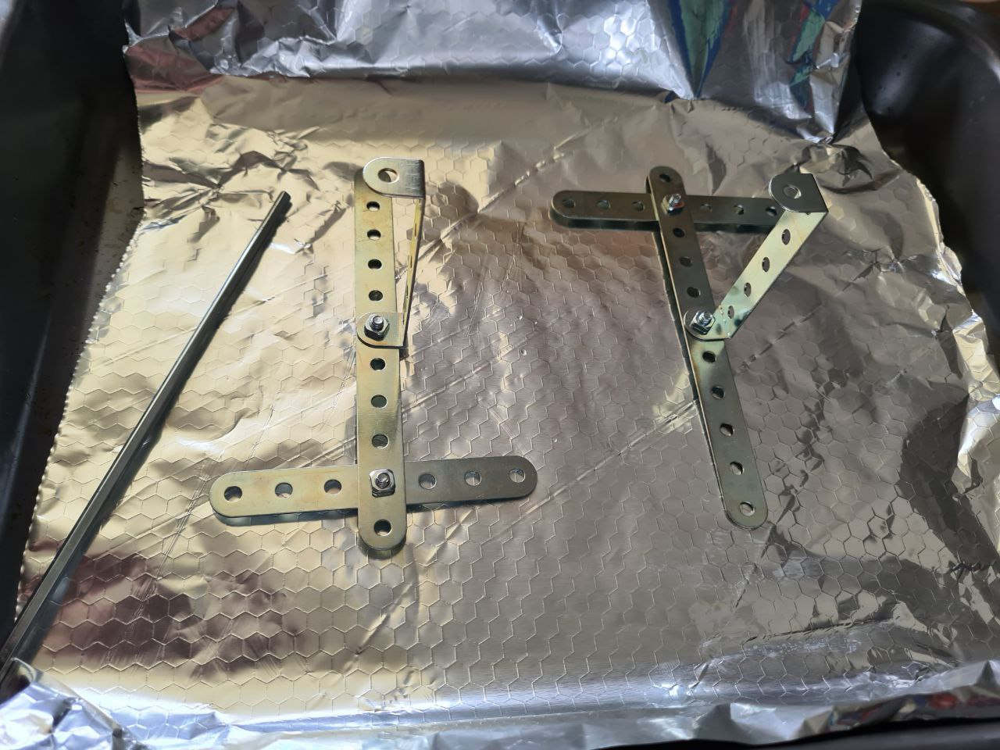
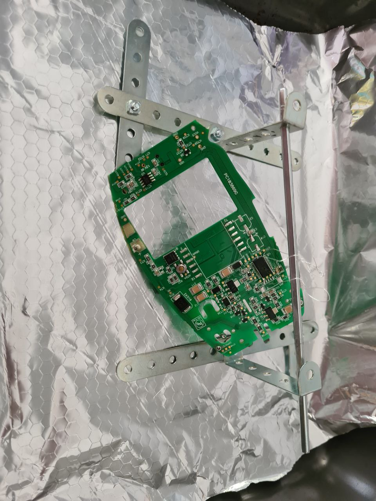
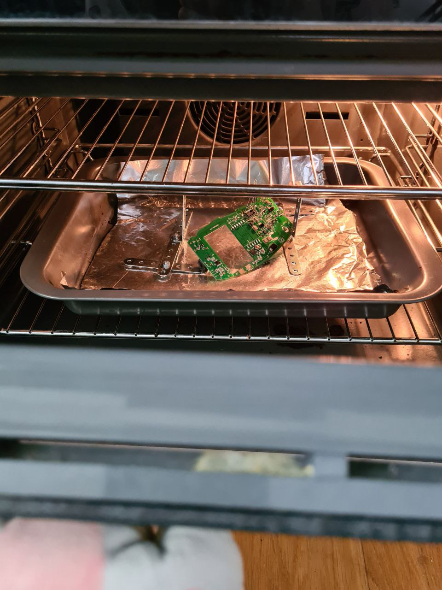
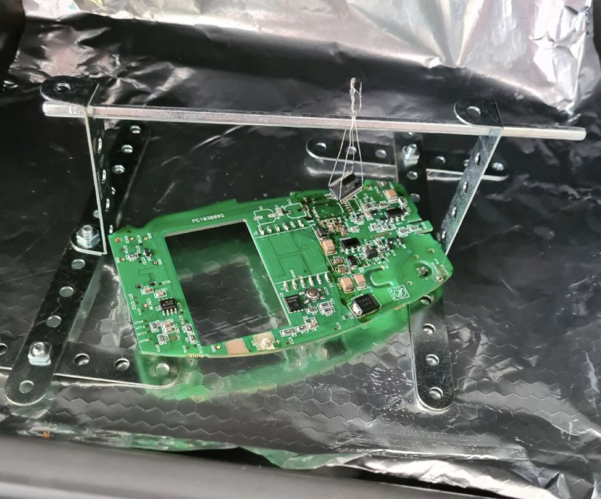

# Baking: unsoldering chips in an oven

### Problem
SOIC and SSOP chips need to be removed from a board.

### Limitations
No heat guns available.

### Tried
Unsoldering pin by pin: long, boring, the chip is dead by the end of the process.

Unsoldering with a desoldering braid: long, boring, the chip is often dead by the end of the process.

### Solution
1. Build a frame. Any frame that would survive +300C is fine - aluminium or steel should be fine.

2. Run a wire under the pins of the chip you want to extract, and hang on a frame. This should create enough tension to tear the chip apart from the board.

3. Set your oven to a temperature slightly higher than needed to melt the solder. Too high, and you will burn the chip. Too low, and you will need to wait for the solder to melt for ages, potentially damaging the chip

4. Look and listen closely. In a few minutes, the board should fall down, leaving your chip in a perfect condition. Caution: hot!

