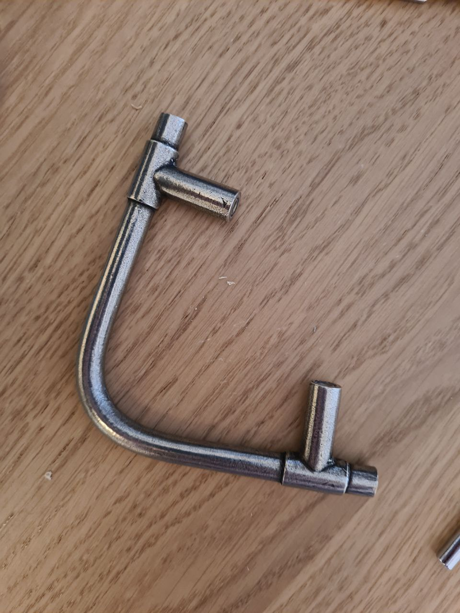
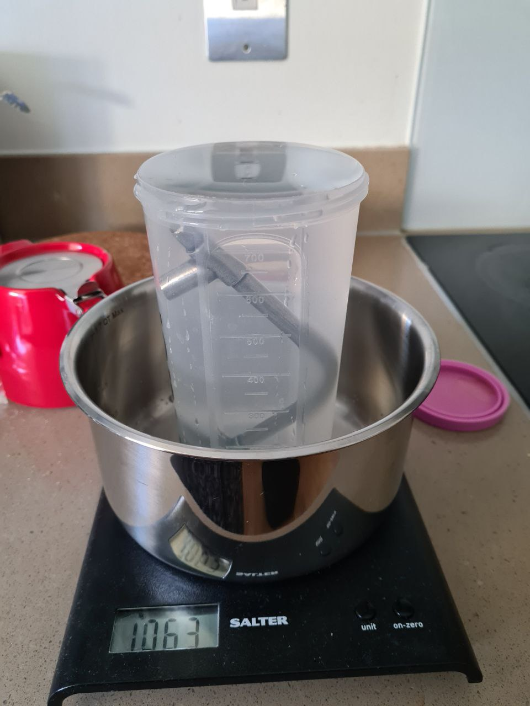
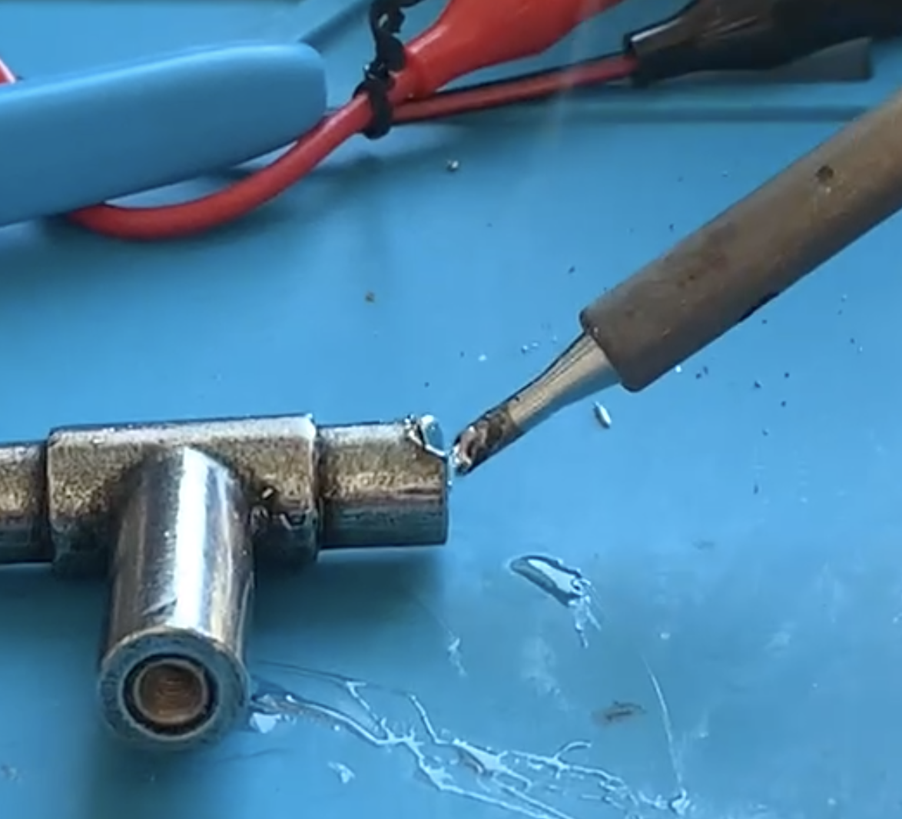
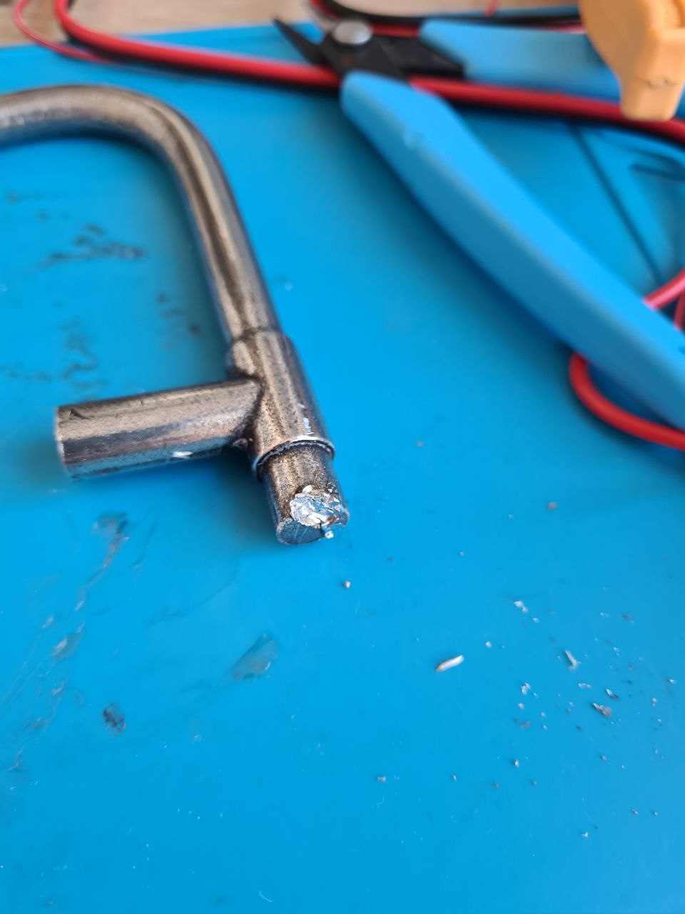

# Pewter as a solder (when you have no tin)

**tl;dr:** Pewter can be used as a solder if you don't have anything better. Take care to avoid its toxic fumes and dust.

I have been reading century-old manuals on hobbyist electronics, and all of them talk about elemental tin like it's something one can easily find. It used to be when tin cans and tin foil were made of tin. But not anymore: "tin foil" is made of aluminium, and "tin cans" are usually steel. Tin, with a melting point of 232C (457F), is a perfect material for soldering. Aluminium (660C) and steel (1370C) are not. But it can be tough to find an elemental tin, as it is expensive and rare nowadays.

So, what do you do if you need solder and cannot buy any? Collect droplets of tin from old devices? Look for tin in antique shops?

It turns out there is a simpler solution: pewter. Plenty of cutlery, knobs and such are made out of pewter. Pewter is a common alloy of tin (Sn, usually 85-99%), antimony (Sb, up to 10%) and other metals like bismuth, copper or silver. Some old pewters might also contain toxic lead, but you can be almost certain that pewter cutlery has no lead inside.

Please note that antimony and bismuth are still somewhat toxic, so take precautions when working with those metals. However, they don't seem to be much more dangerous than lead (Pb), which was commonly used in solder materials of the past. They also seem to be fairly standard components of modern "non-toxic lead-free" solders. So, I guess standard lead-soldering precautions should be enough. So, wash your hands, use good ventilation, wear a good face mask, and you should be safe-ish, I think.

How to make sure it's pewter you've found? The first tell-tale of pewter is flexibility. The material is so soft it won't really "ring", and you should be able to bend it with your bare hands. Even if it's a thick drawer handle like the one I found:

Tin's density is around 5.7g/ml. What is the density of the alloy I have? I made a simple device to measure the amount of water displaced by this pewter bar. My scales are not precise, and I am a bit sloppy, but it seems that the density of my thingy is somewhere between 5.5 and 5.7g/ml. That will do!

Now, the question: will it melt as quickly as regular solder? Will it be possible to solder with it as it was a standard solder? The answer is: yes, very much so, with the use of a decent flux. In fact, it was easy and reasonably pleasant to do. But as I do not know what exactly is inside this pewter door handle, I will keep using my regular factory-made solder instead. For safety.

