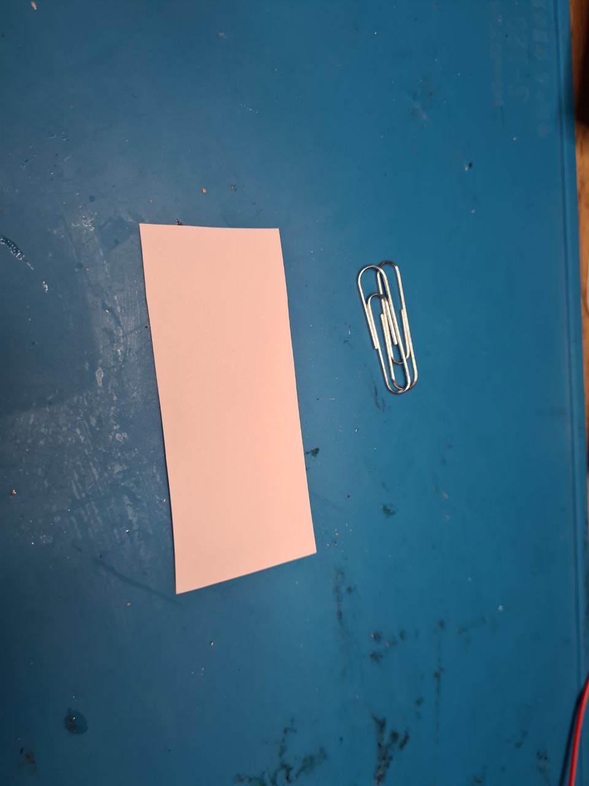
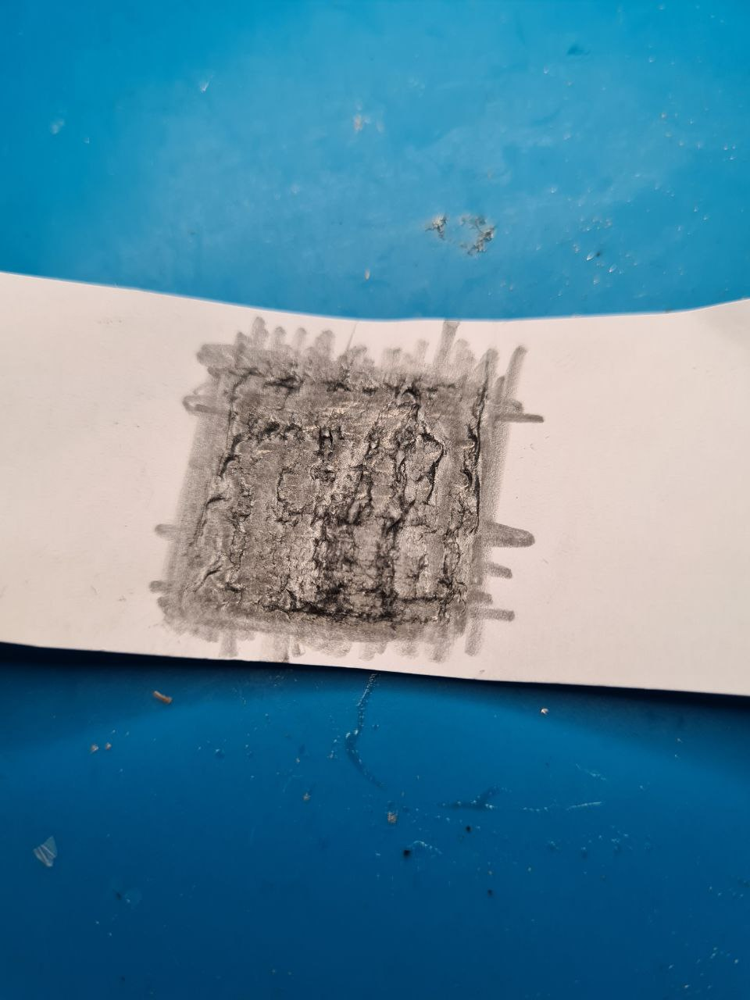
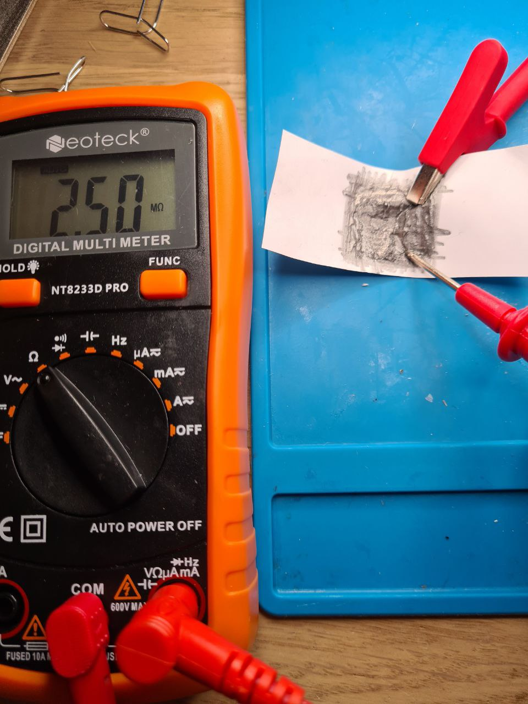
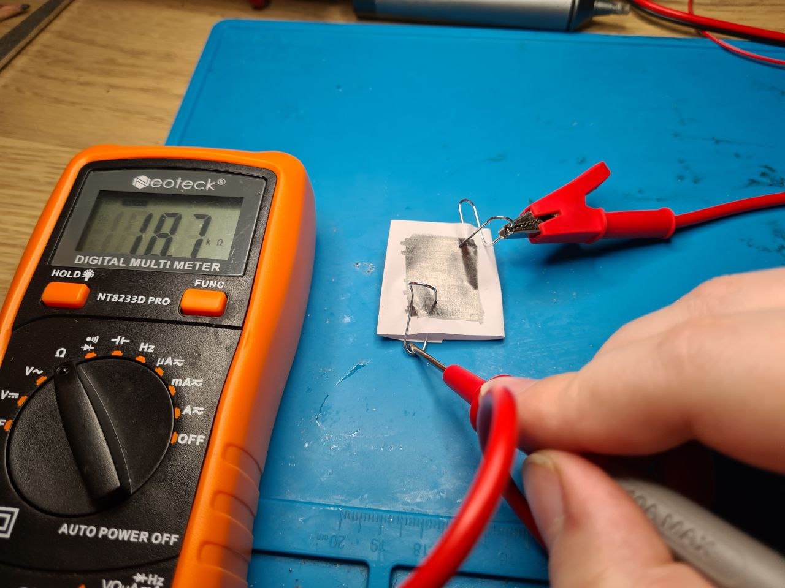
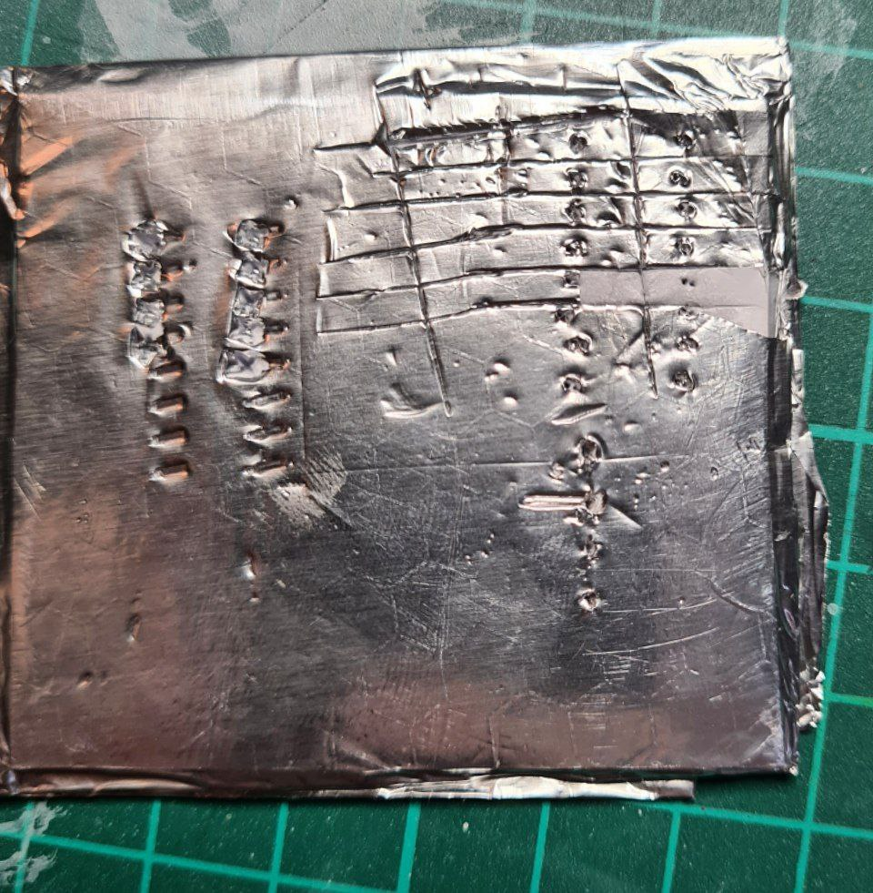
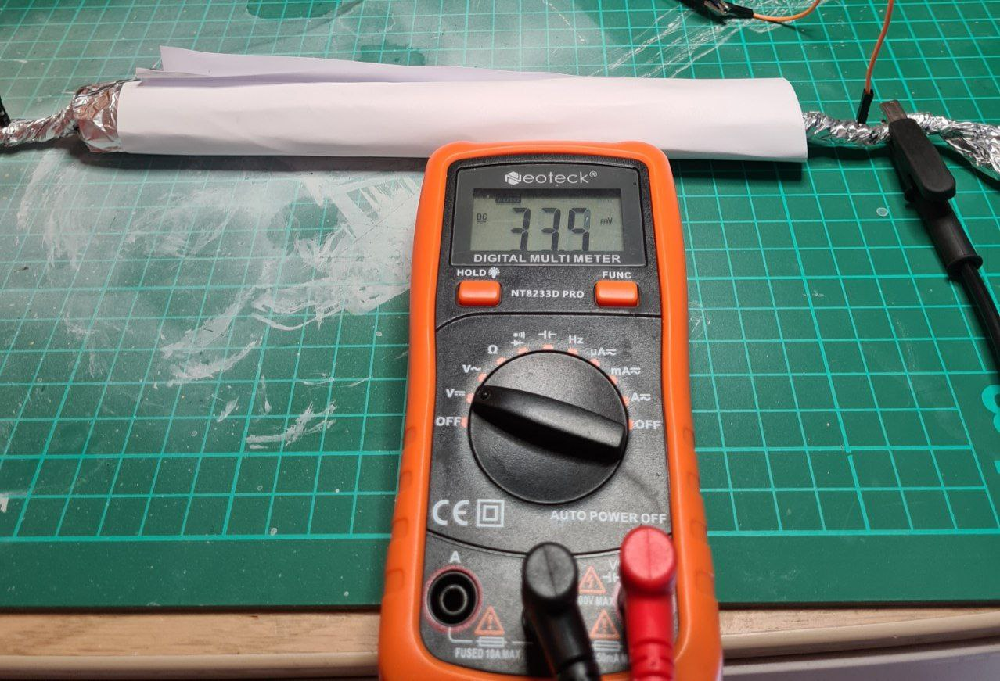

# POORLY made substitutes for components

I had a few chats in the past where people brushed off availability of common passive components, because they are so simple they can be made from things found in a typical western household. But is that so?

## Resistance is (mostly) futile
A few online guides say that resistors can be made easily from paper clips, a strip of paper and a pencil.

Even a century-old hobbyist magazine stated that a resistor of 2-3 MOhms can be made this way. I tried to scribble on a scrap of paper tightly, and the paper got quickly damaged.

Not surprisingly, graphite has some conductivity. The resistance is around 2.5 MOhms indeed, but it is probably highly volatile, and the whole thing looks, to put it mildly, fragile.

Using better paper, pencil and firm surface gives a less fragile more conductive resistor. It worked for me as a current-limiting resistor for lighting up an LED, but it seemed that the (s)crap resistance changed not only from the position of the clips, but from the voltage applied as well.

**Verdict**: not suitable for anything useful. If you want to make resistors at home, you need a better technology.

## Paper + cheap glue + foil = PCB? (Ha-ha, no)
There is plenty of guides on how to use factory-made bare PCBs, but there is very little information on how to make boards at home. The only YouTube video I found recommended to glue together some paper and aluminium foil. I was sceptical, but tried it nevertheless. I guess this could work for some kind of a school project, but it is not suitable even for DIP (2.54mm grid) components. If you cut your tracks well, they won't stay attached to the cardboard base. If you cut carefully, short circuit is likely. It's very unreliable, fragile, and overall unpleasant to work with.

**Verdict**: Nope. Just nope. Better invest in some cotton paper and epoxy, I guess...

## Paper + cheap glue + foil = Capacitor? (Um, kind of)
This is yet another recipe that can be found both online and in vintage magazines. In theory, you put two pieces of aluminium foil, separate them with paper, and get a capacitor. For a flat one, capacity is C = e * e0 * S / d.

If I'm not mistaken:
* e0 = 8,85*10^-12
* e for paper is between 2 and 3.5; let's say 2.5
* S is 0.2 by 0.2 metres = 0.04 sq m
* d is about 0.1 mm for my paper => 0.0001 m
* C => 885 * 10^-12 = 885 pF = 0.885 nF = 0.000885 uF

The actual capacitance depends on the paper, the glue and the precision of your work. If you roll the capacitor, as I did, its capacitance will change as well. Nevertheless, it was not high enough to register on my multimeter (therefore, less than 0.01 uF). The capacitor seemed to be working, charging and discharging, but due to the sloppy implementation it had a relatively high resistance. On top of that, it charged to a few dozens mV without any power source attached (though this is somewhat expected, I think). It's bulky, and its capacity will vary depending on the humidity, because water will affect glue and paper.

**Verdict**: _maybe_ could be used with some caution and careful execution.
