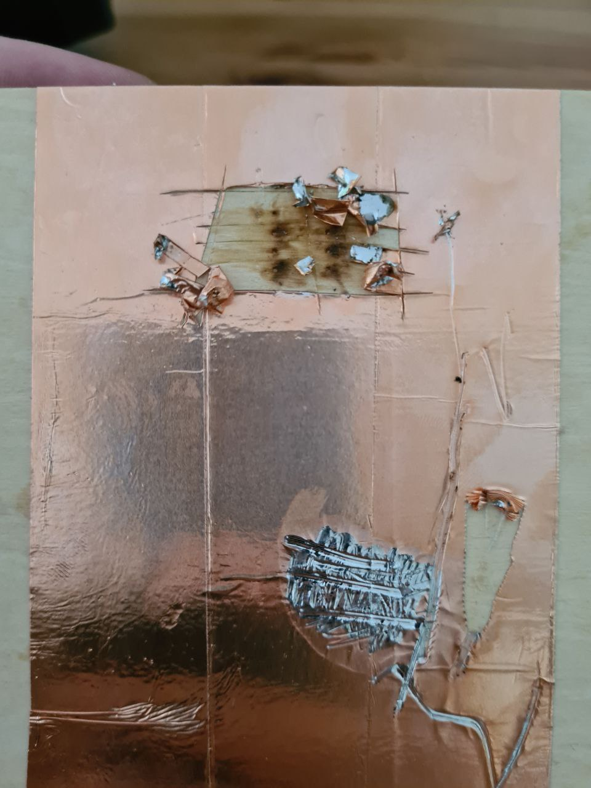

# Plywood PCB

Situation: lack of prototyping boards.
Possible solution: get some copper tape (should be widely available) and a board.

## Cardboard?

My first approach was to use a piece of decent cardboard.

The tape worked fine, and it was easy to make holes for mounting components in it.

Alas, an attempt to make tracks has proved that the cardboard is too soft.

## Plywood!
Thin plywood isn't terrible as a craft material and it would work for point-to-point montage. But can I make tracks with it?

The first test is drilling. Drilling with 0.8mm bit worked perfectly, no visible damage to the board nor copper tape was done.

Cutting tracks and soldering was an OK experience. The plywood and the tape are soft enough to warp from the blade or the tip of the soldering iron, but not enough to get damaged if you are careful. A quick test with ohmmeter showed that this can work for 2.54mm montage, easily.

The flux is leaking through the board. Perhaps, covering the plywood with paint might fix this issue, and also improve general durability?

Surprisingly, components are attached quite hard to the board, and require significant force to remove from the board. And this uncovered the biggest letdown of this approach: re-soldering of the components is virtually impossible due to how easy it is to damage the tracks.

This approach might just work for some purposes. It surely is much more reliable than aluminium foil over paper.
