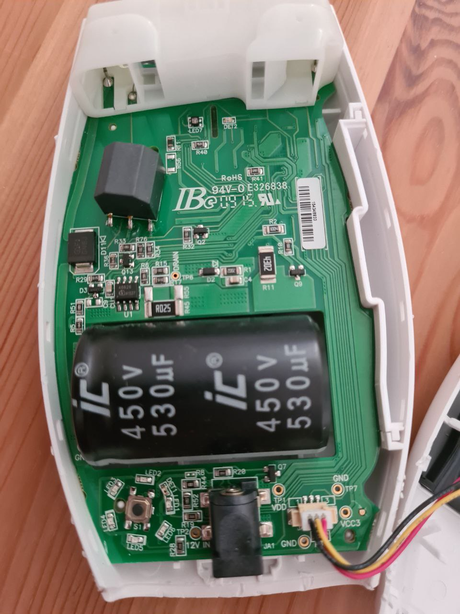
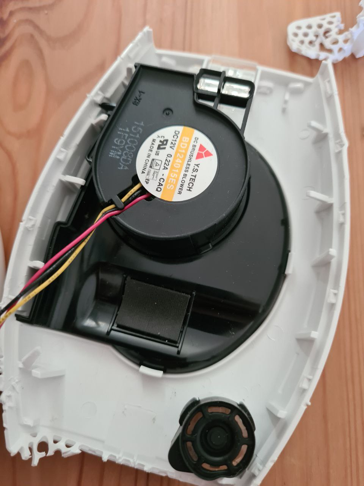
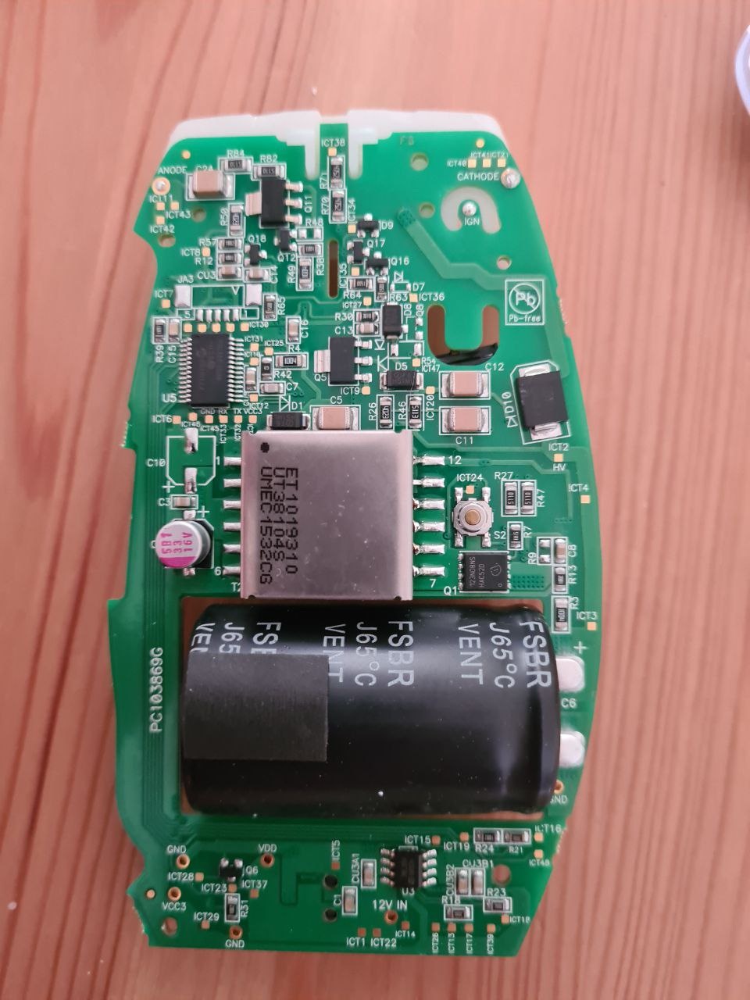
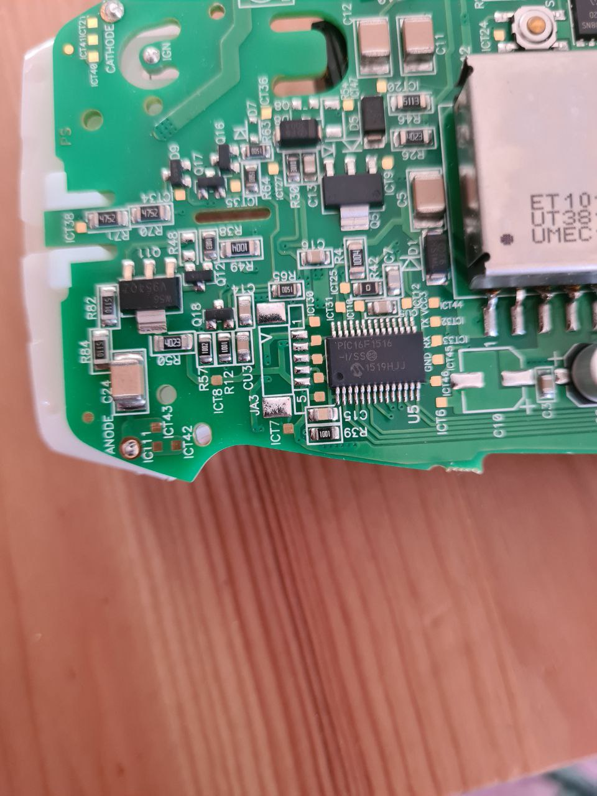
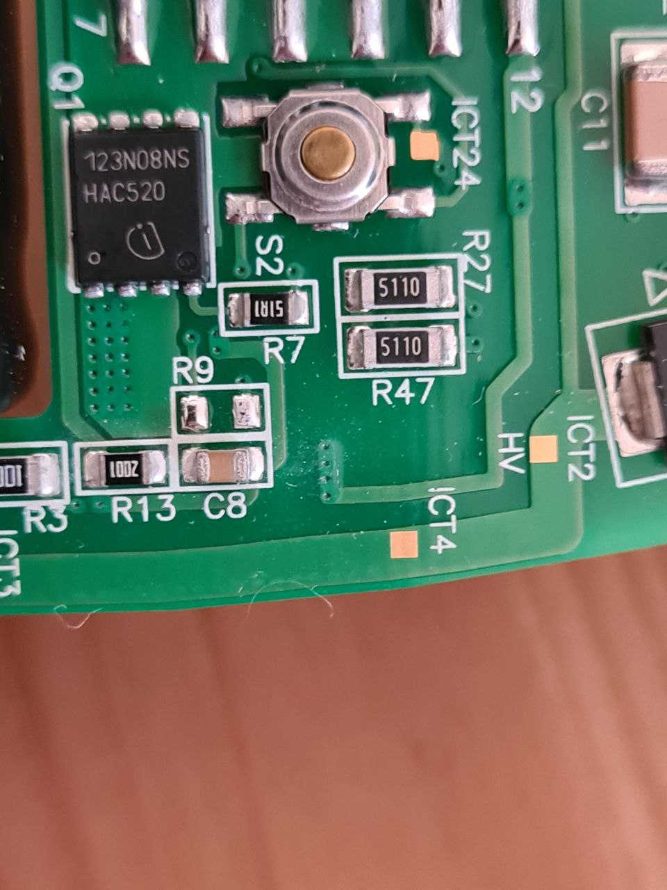
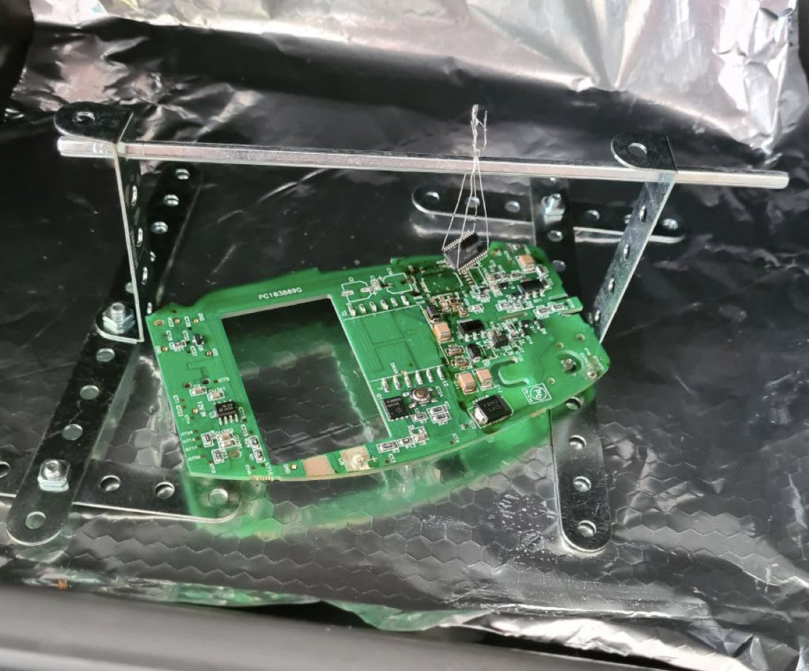
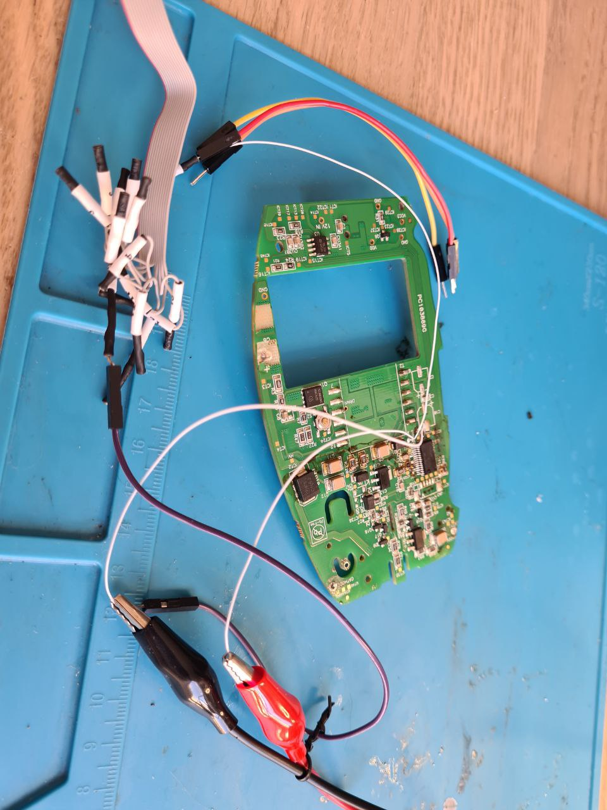

# PIC16F from a photoepilator

My photoepilator broke a couple of years ago, but I had no willpower to throw it away. I managed to extract a PIC16F in presumably full working order from it, as well as some extra nice things.

One of the biggest challenges was to open the case.

A lovely fan can be scavenged without any hassle.

I am not comfortable with trying to power on the lightbulb, but I can make a use of transformers, capacitors and inductors.

The SSOP-28 chip is PIC16F1516. It has 8k words of EEPROM memory, and with a built-in 16 MHz oscillator it should be capable of 5 DMIPS. It's going to be a challenge to unsolder it!

Some extra spare parts are diodes and power transistors.

I extracted PIC16F in an oven.
  

I have not had any better test board for an SSOP chip, so I soldered it back to connect to an UART. It works!

When I will figure out how to make a SSOP-28 breakout board for it, I might return to this chip.
