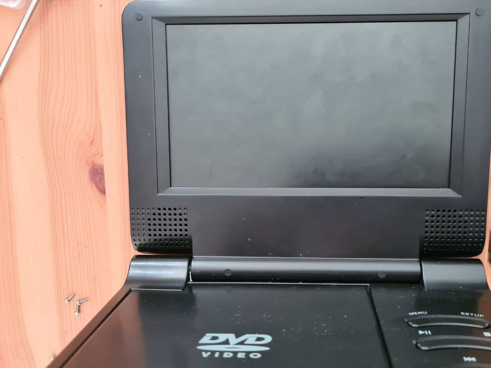
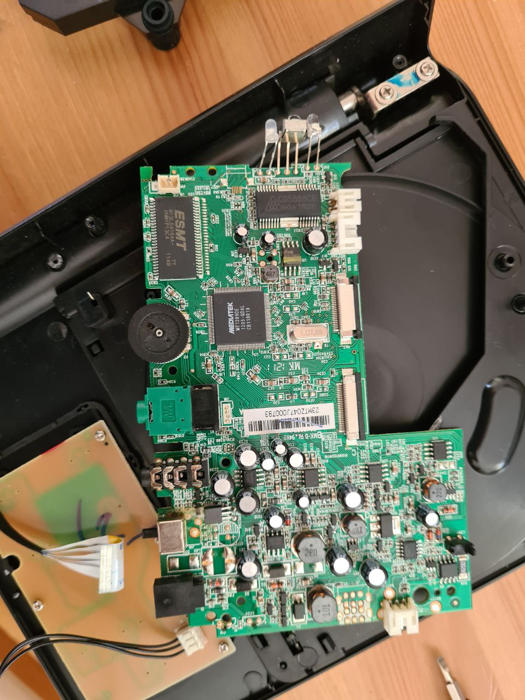
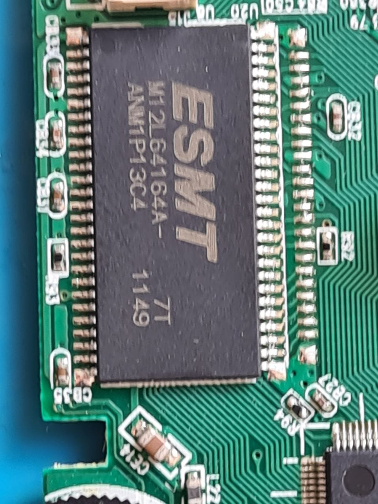
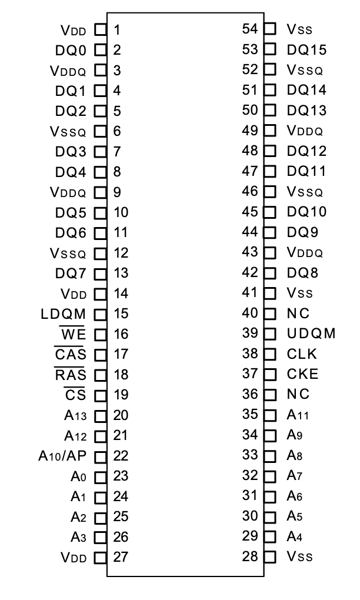
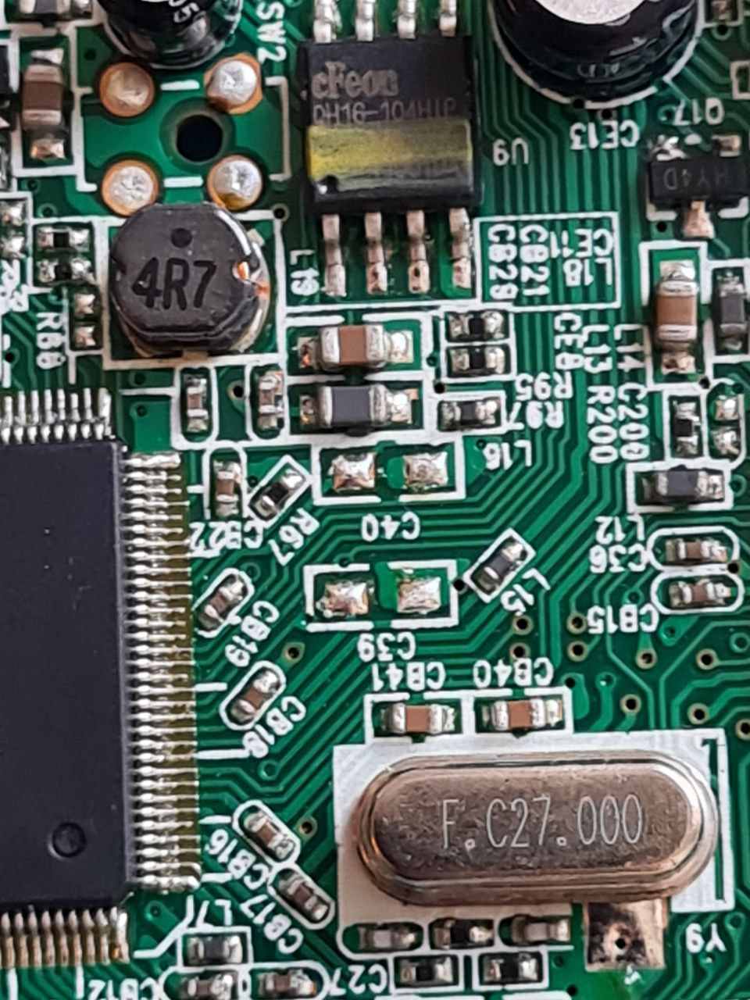
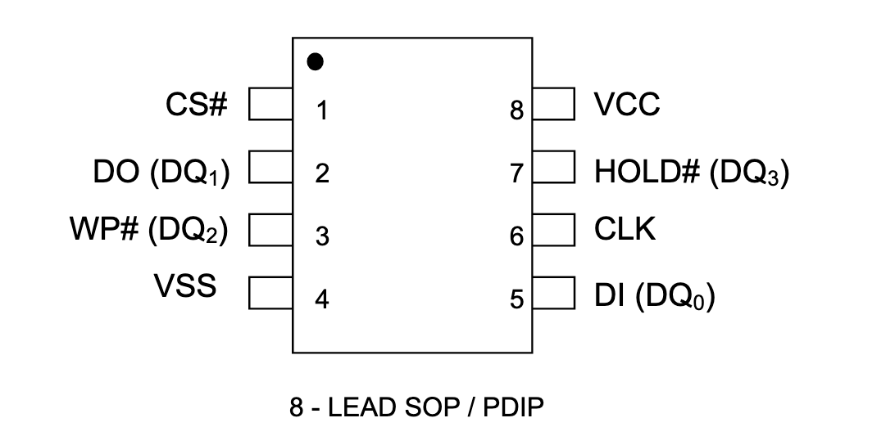
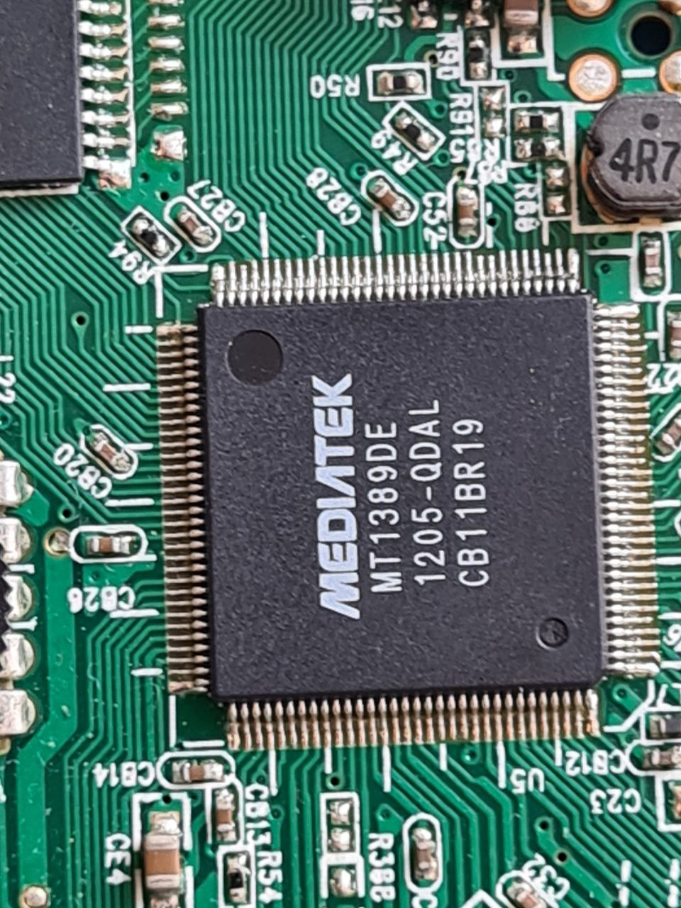

# 8MB SDRAM and 2MB Flash from a DVD player

Someone got rid of a DVD player. It can only play DVDs, because there is no video input port.

The main board is built around the main chip, but there are few scavenge-worthy things.

First, there's 8MB SDRAM chip. It is DRAM, so it needs a controller to be used with a generic MCU. But it might be useful for bigger computer designs.

Second, there's very much re-usable SPI/Quad SPI Flash, and it's 2MB big!

The CPU is a custom solution for DVD by MTK. It seems to have a 8051 clone inside and a custom RISC for DVD decoding, but it is probably quite hard to reflow or reprogram. Unless you want to change the contents of the SPI flash to make it a general-purpose computer or something. I certainly do not, sounds like a lot of hassle for now.

If you are really curious about the chip, it has USB support (that's why there's 27MHz quartz), a bunch of GPIO, and a hardware UART. If you figure out how to re-flash the device, of course.
