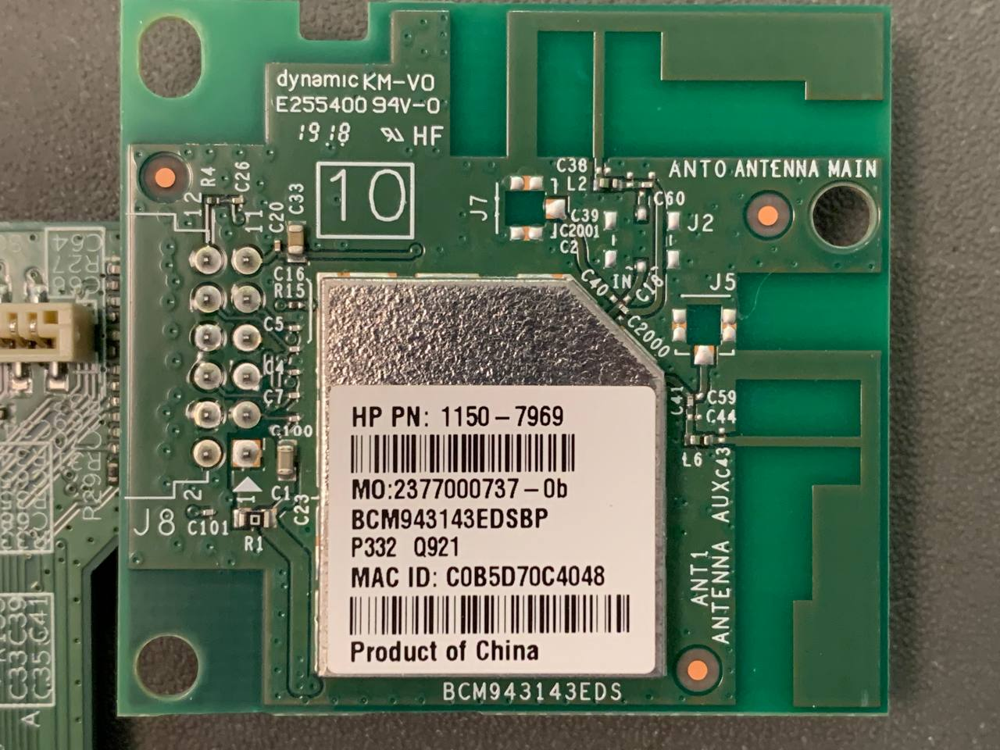
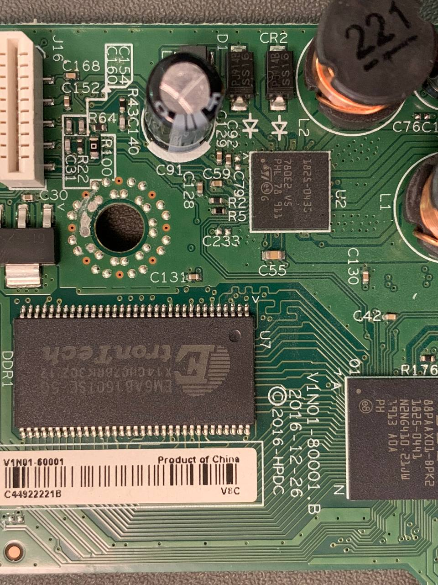
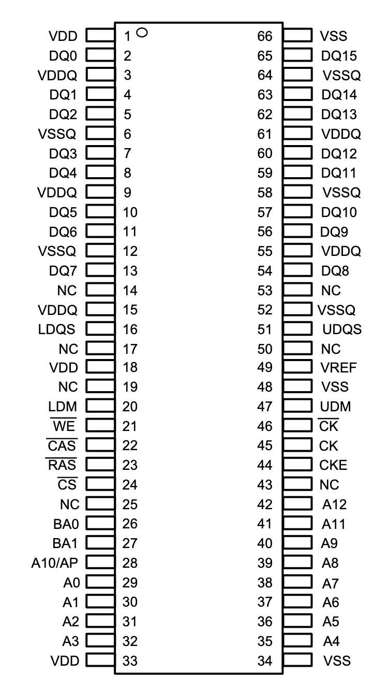
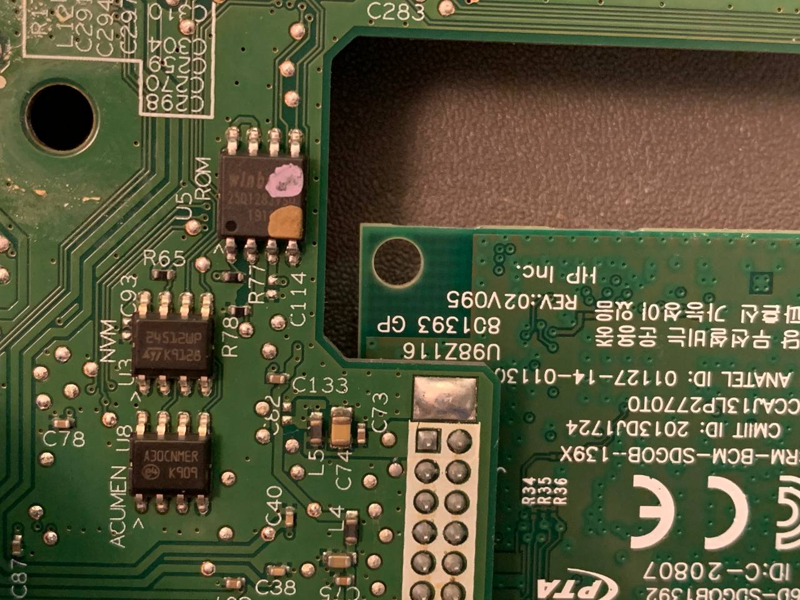
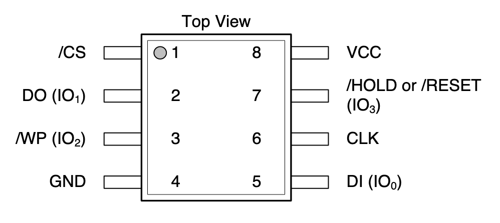
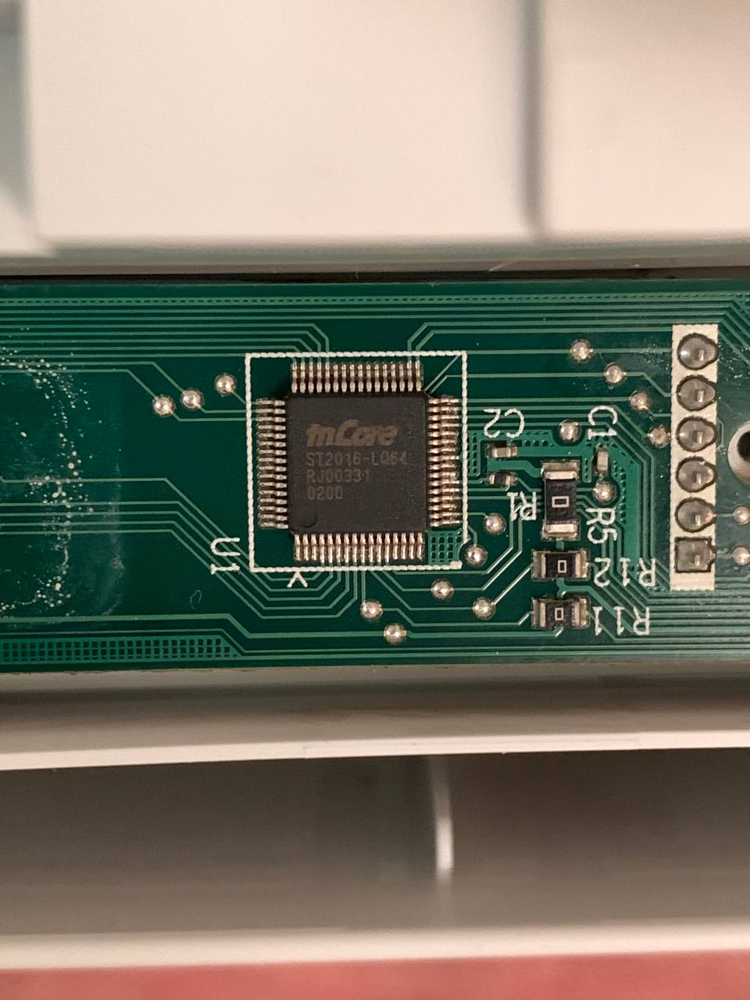

# WiFi, 64MB SDRAM and 16MB Flash from a printer

Someone discarded an inkjet printer at our place. The CPU (88PAAX) is proprietary with no details available to general public, seems to have an ARM core, but it is pretty much unusable because it is BGA.

## WiFi SDIO
The printer has a ready-to-use WiFi SDIO module BCM943143. I do not know how hard it will be to re-use, but I hope not so hard. It's SDIO, after all.

## RAM
The board has an SDRAM chip 32Mx16, 64MB in total.

   

## ROM
Another thing hiding on the board is a re-usable 16MB Winbond Flash chip for SPI/Quad SPI. There is also an 24512WP, 64KB I2C EEPROM. No idea what Acumen AC30NMER is, though.

      

## Extra
There was a small 8-bit MCU to control a tiny monochrome LCD. It is a mask ROM chip, though.

There is also a big interesting chip ST 1825-0435, it's 12x12 BGA - with no other details known about it.
