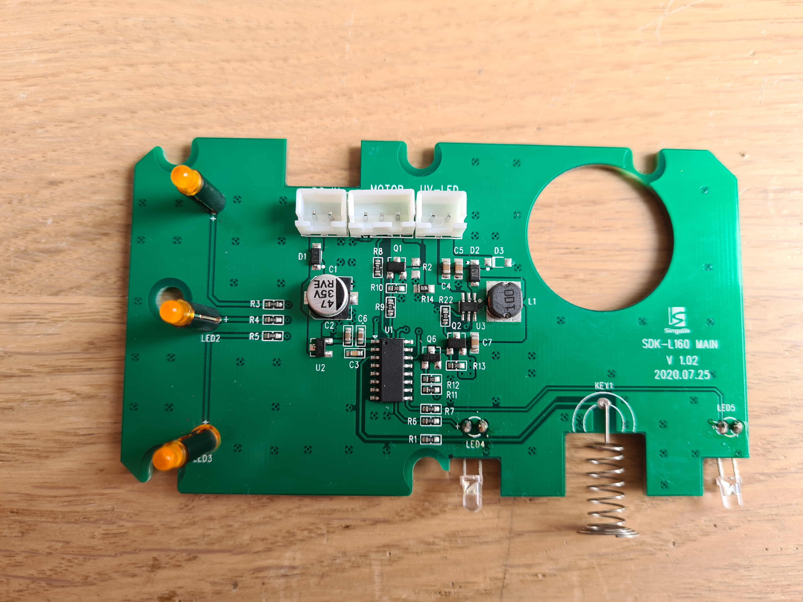
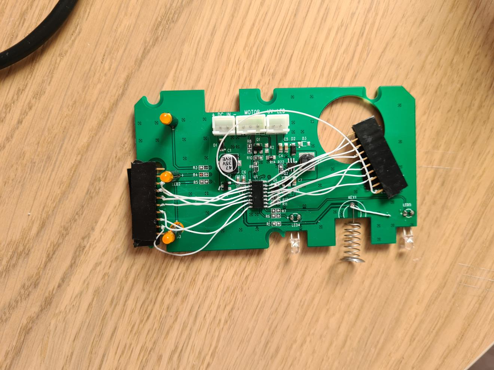

# Mysterious microcontroller in a pet fountain

I decided to experiment on scavenging different parts from faulty electronics. My first candidate was a broken pet fountain that had a touch sensor button and a UV LED. There was a SOIC-16 chip without labels on the main board, too! What is it?

The back of the board had 4 debug pins; two of them were GND/VCC. It was highly likely that the other two were RX/TX - and indeed I recorded "mode..SYS_NORMAL.." at 19200 baud from the pins.

Now the real challenge is to identify the controller.

What I know is that pin 1 is VCC, and pin 16 is GND. UART is wired to pins 14 and 15 (though I do not know whether the device actually responds to any commands). No other pins are connected to VCC nor GND.

It is fairly certain that this isn't PIC, because there are no PICs in 16 pin bodies. AT and STM seem to have very different pinouts. I came up with a shortlist of controllers that might be this bad girl.

The only controller I found that has VCC/GND/UART on those pins is SM51F: https://datasheet.lcsc.com/lcsc/1809211431_SINOMICON-SM51F20TD2_C187850.pdf
I tried to signal on TDI+TCK and hoped to see some output on TMS or TDO - but either I did something wrong, or this is a different controller after all.

The other candidates are:
https://www.mouser.co.uk/datasheet/2/302/MC68HC908QY4A-1126599.pdf - tried to bit-bang the firmware port in low-voltage mode, no luck.

Three other candidates have hardware UART on other pins, so I think it's less likely that developers used software UART while using HW UART pins for LEDs
https://datasheet.lcsc.com/lcsc/2005191704_Cmsemicon-CMS79F5139_C541886.pdf
https://datasheet.lcsc.com/lcsc/1810010217_Holtek-Semicon-HT66F0176_C82355.pdf
https://datasheet.lcsc.com/lcsc/2006221817_XDS-XDS901_C691126.pdf

This chip happens to have SDI/SDO on pins 14/15: https://datasheet.lcsc.com/lcsc/2007311536_FMD-Fremont-Micro-Devices-FT61F0A3-RB_C708798.pdf
But there is no signal on presumed SCK, and it's not on the test pins, so it's not SPI-that-happened-to-be-19200, but UART. And if that's the chip, then it has to be "software UART when HW UART is available".

Finally, the last chip I suspect is infamous PADAUK (the manufacturer of 3 cent chips):
https://datasheet.lcsc.com/lcsc/1810251551_PADAUK-Tech-PMC131-S16_C317578.pdf
If that is the case, the chip is of no use because it's one-time programmable. But I have no idea how to confirm or deny the hypothesis.

The next step would be to check VA characteristics and maybe timings to see if any of those fit the controller in question. This project is on pause for now.
