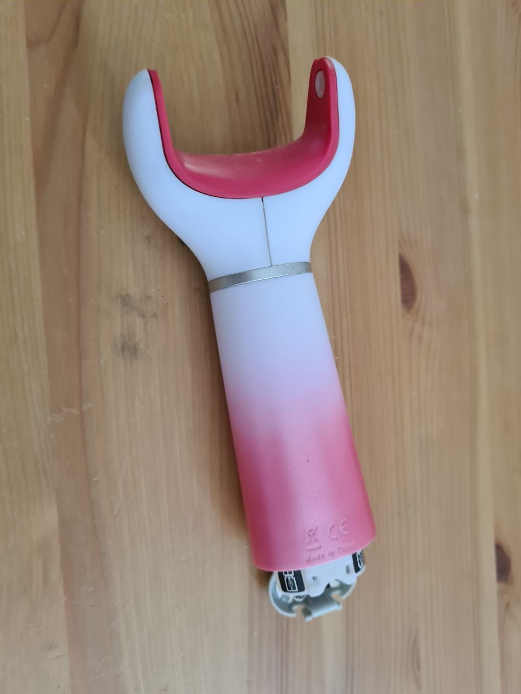
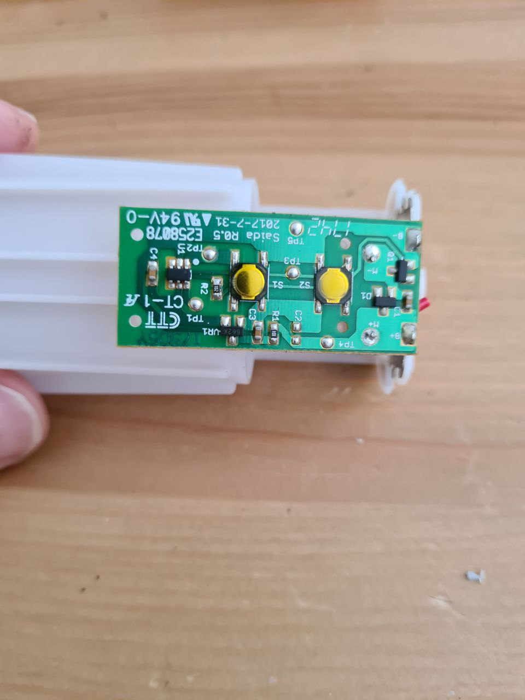
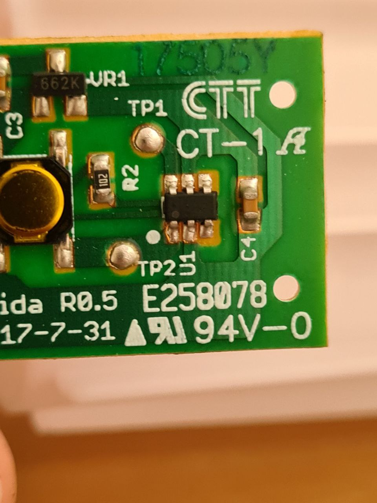
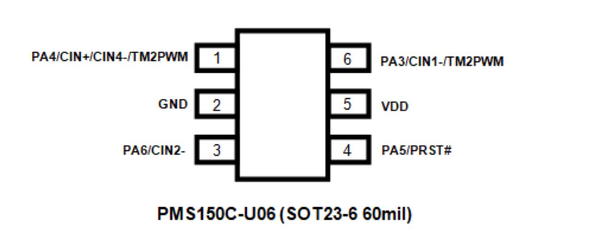
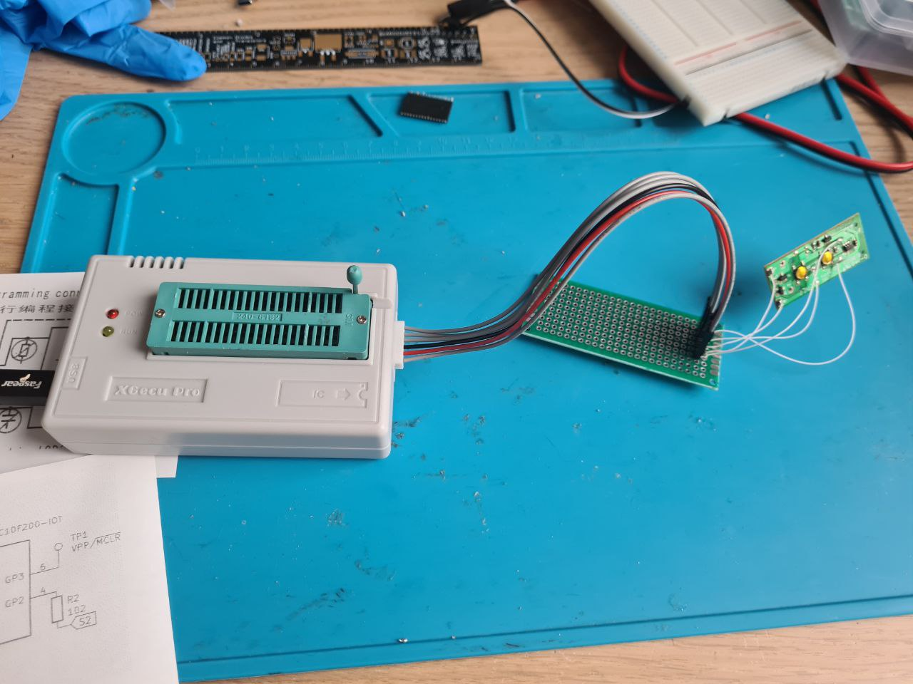
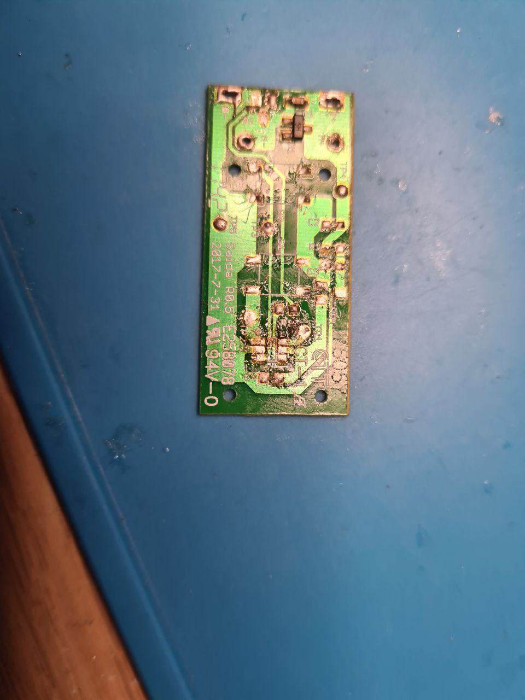

# Mysterious microcontroller in a foot file

My battery-powered foot file broke a while ago. Just stopped working, and that's it.
Let's see if there is a computer in it?

It looks like a tiny microcontroller, doesn't it.

There are no labels, so it can actually be custom-made chip just for this purpose.

But there are at least two microcontrollers that fit the pinout. One is Padauk PMS150, and another is PIC10F2xx.

I suspected that the test pin TP1 is a serial interface, but I didn't see anything on it. This is the pin used for MCLR/VPP on PIC10, and TP1 was connected only to this  pin, so it is more likely that this chip is PIC10, not Padauk. I made a simple ICSP connector.

It didn't work. I started to wonder whether the chip itself was alive. Turns out, it wasn't - no reaction to any inputs from pins where buttons were connected. Perhaps, the chip was dead already? We will never know. Ha-ha, unless my second unit of the same model won't break down (and in a different way from this one).

The only thing that is useful for me on this board is the board itself. Because now I can solder my Padauk 150 (I have some) to this salvaged SOT23-6 breakout board.

