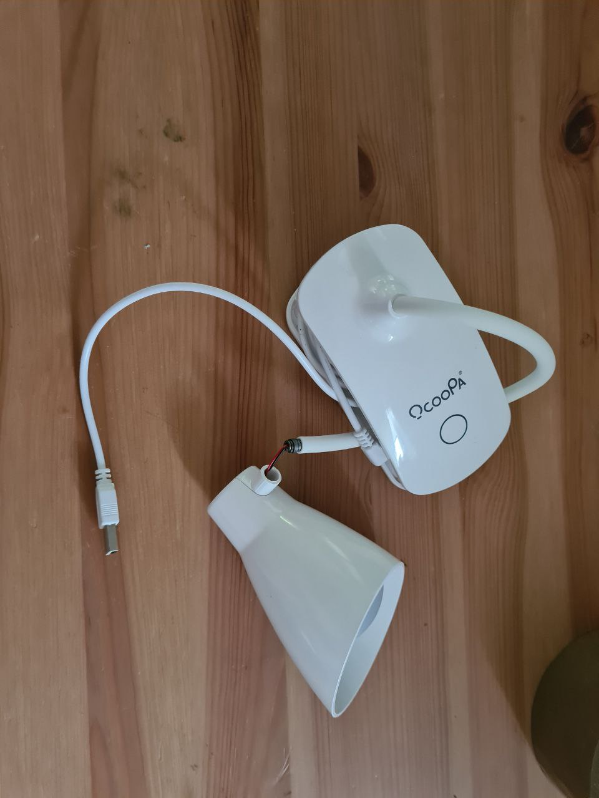
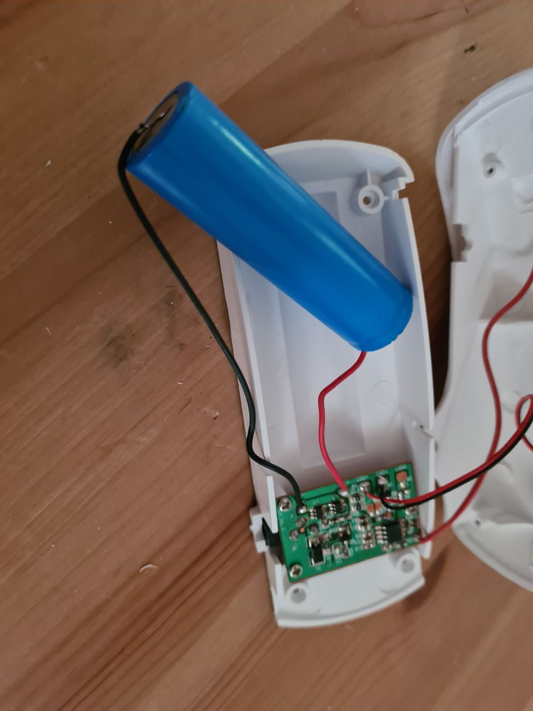
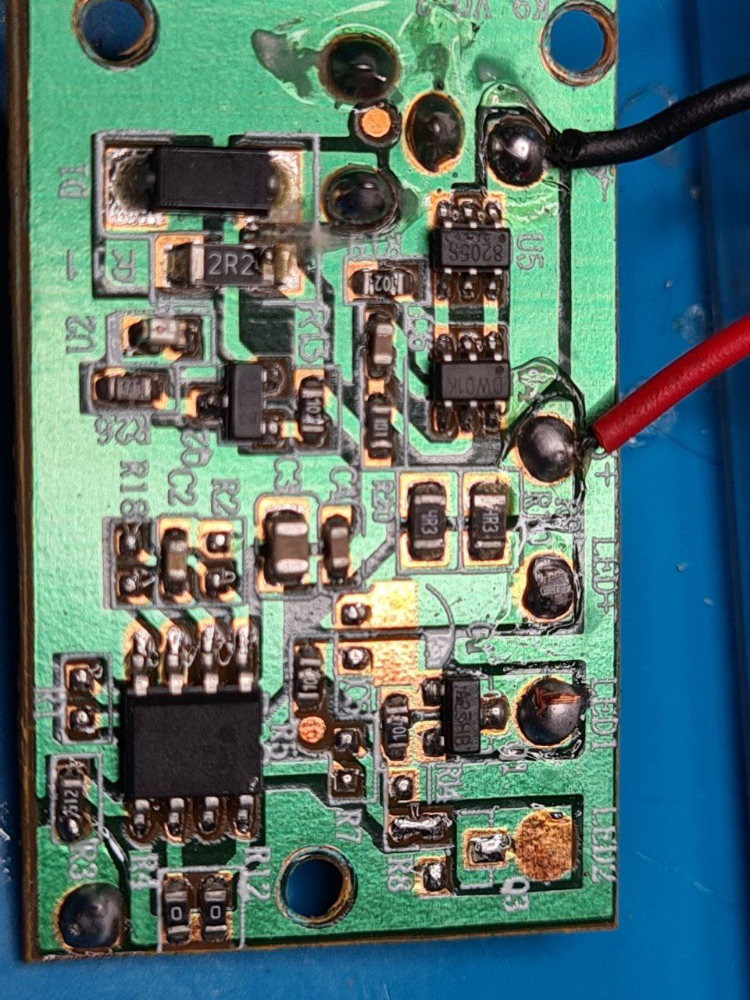
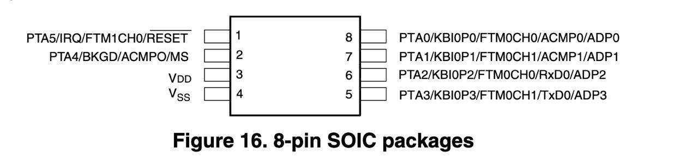
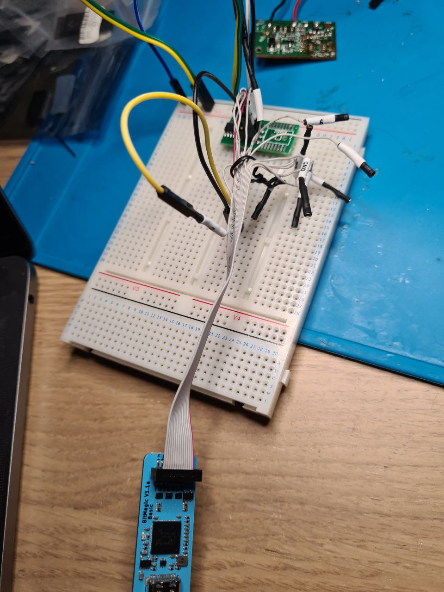
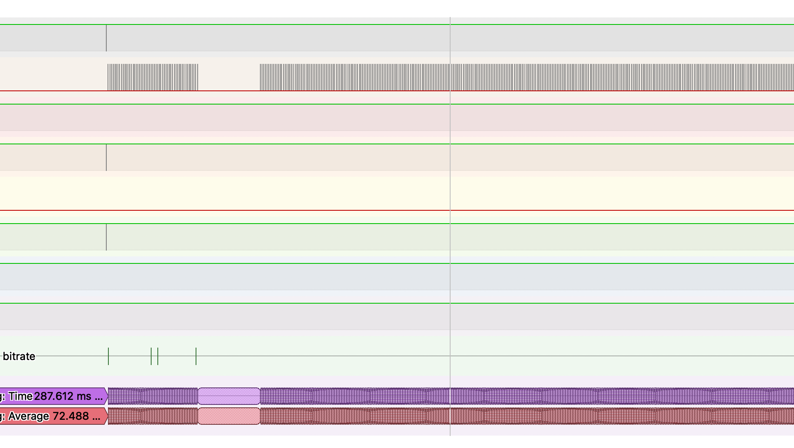

# HCS08 from a lamp that was a bit too smart

In a box of broken electronics I noticed a small USB-powered desktop lamp. It had only one button that turned it on and off.

I did not expect to find a Li-Ion battery inside.

There are two small chips to control the battery charge, and one 8-pin chip that looks suspicious.

A chip from HCS08 microcontroller family seems to fit the bill. It should have 2-to-8 KB of Flash, and generally is not bad for a small MCU.

I plugged BitMagic to the chip to see how it behaves.

And, naturally, it acts exactly like HCS08 datasheet describes, signalling readiness for the programming/debugging by clock pulses on one of the pins for a short time after a reset.

While the protocol for programming is open-source and fairly simple, it is not supported by my flasher. I was about to implement it on RP2040 when I realised that a ready-made flasher costs like $10, so I just ordered one.

To be continued?
