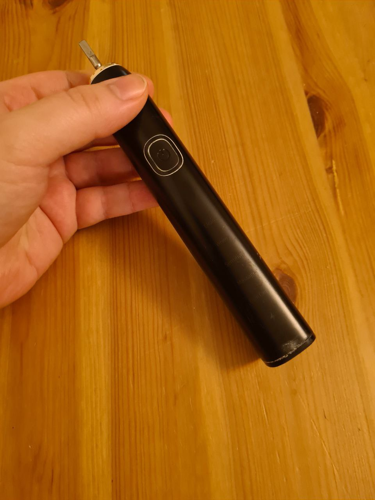
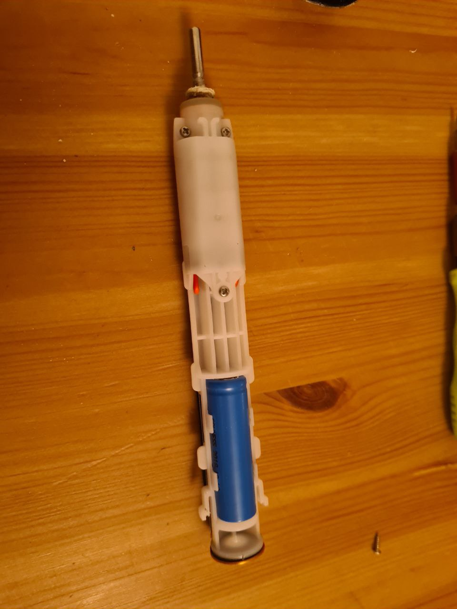
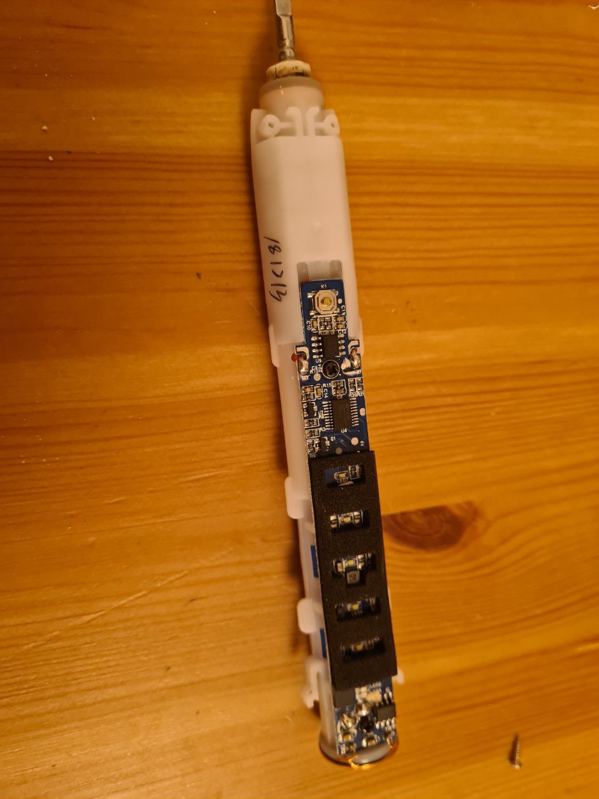
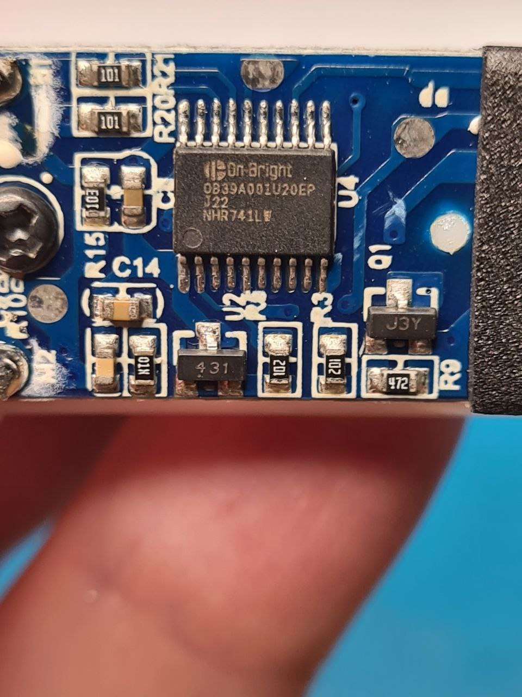
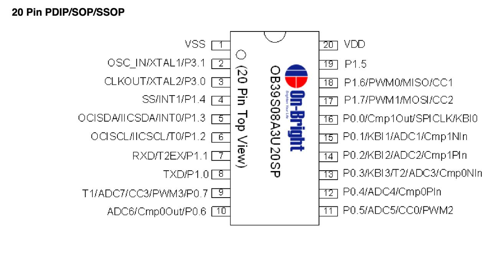
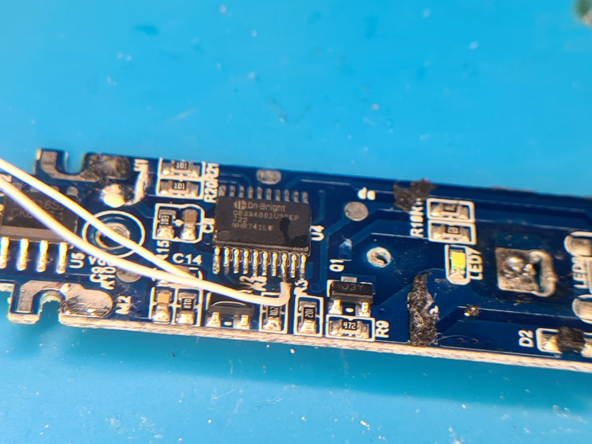
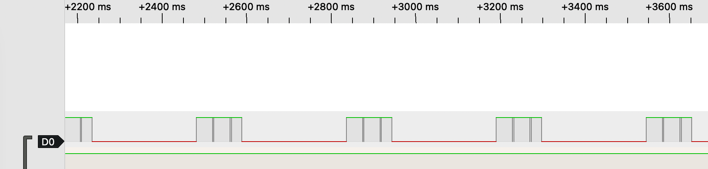

# Do electrical toothbrushes dream of UART?

My favourite toothbrush stopped powering on.

Turns out, the Li-ion battery was dead.

The board is pretty neat, with two chips to control the battery and one 20-pin microcontroller.

This is definitely a microcontroller.

You know that you are going to have a hard time when Google says there are no search results.

Lurking around Chinese websites, I could make a reasonably fair guess that this chip is related to OB39 series of controllers (bravo, Sherlock).

According to On-Bright datasheet, while this chip should have onboard UART and lots of tasty computing stuff inside, it comes with a proprietary flasher/bootloader, so it's unlikely I would be able to do anything useful with it. I decided to give it a try anyway.

Signals on TX pin do not like a normal UART. Perhaps, it's time to give up on this chip. Salvaged parts: a coil that can be powered by my wireless charger. 

