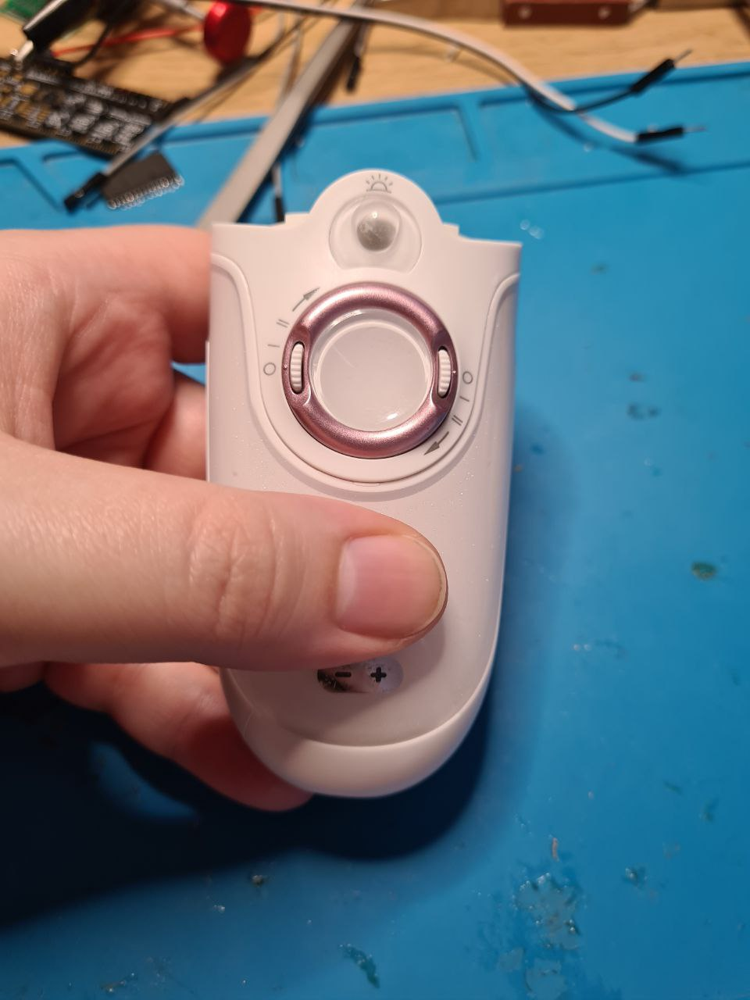
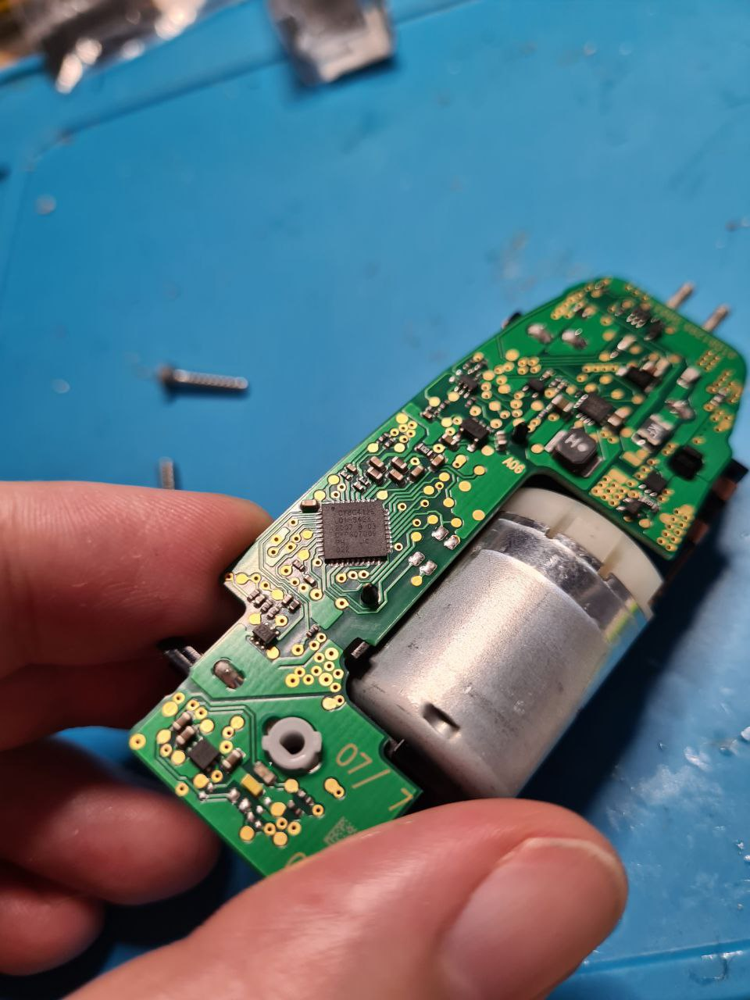
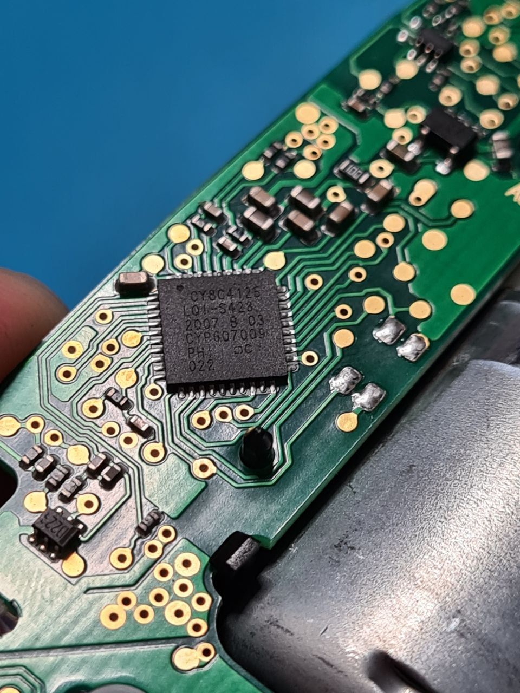

# Can a battery-powered shaver run Doom?

A battery died in an electric shaver/epilator, so it's time to see what's inside!

The device can be disassembled and assembled back fairly easy. I am not sure it will stay waterproof after this procedure, though. The motherboard is very neat. Wait, what is this big chip?

This is, my friends, an ARM Cortex M0 running at 48 MHz. Does a shaver with a mechanical switch need _any_ controller at all?

The chip is way too small to desolder manually, and because of climate change it's too hot to run an oven now, so the project is on hold.
