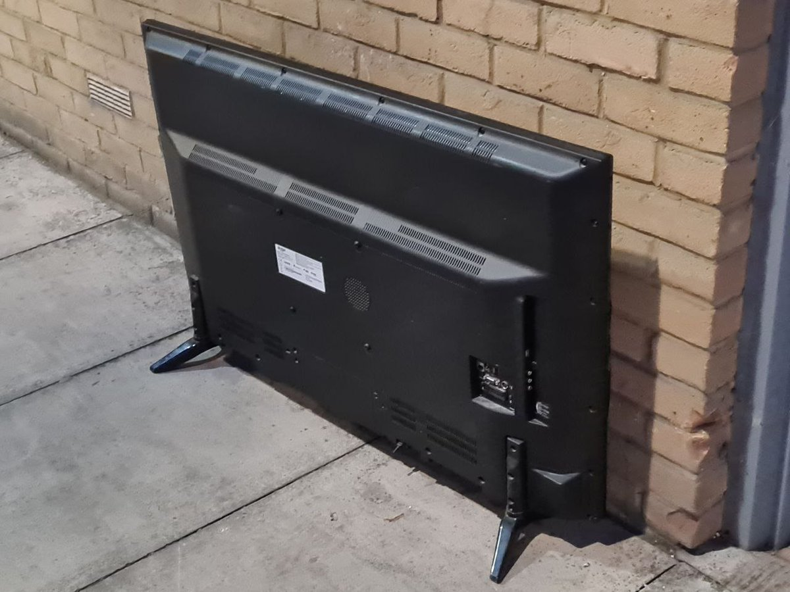
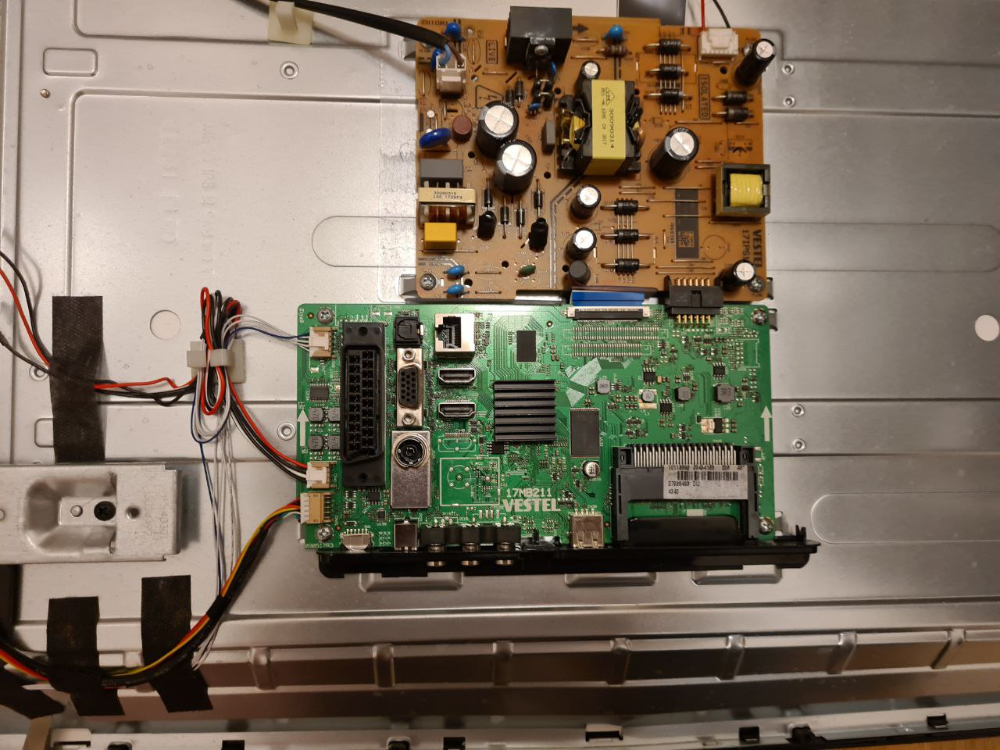
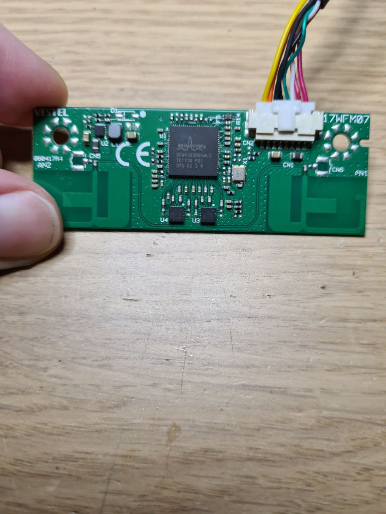
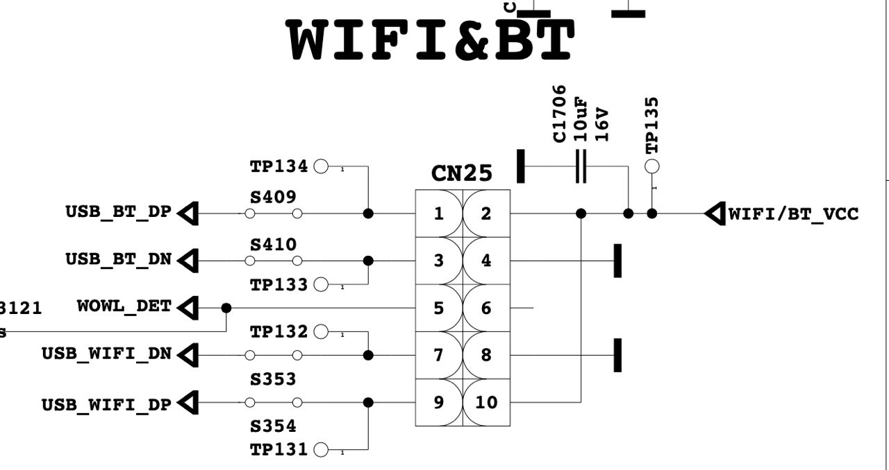
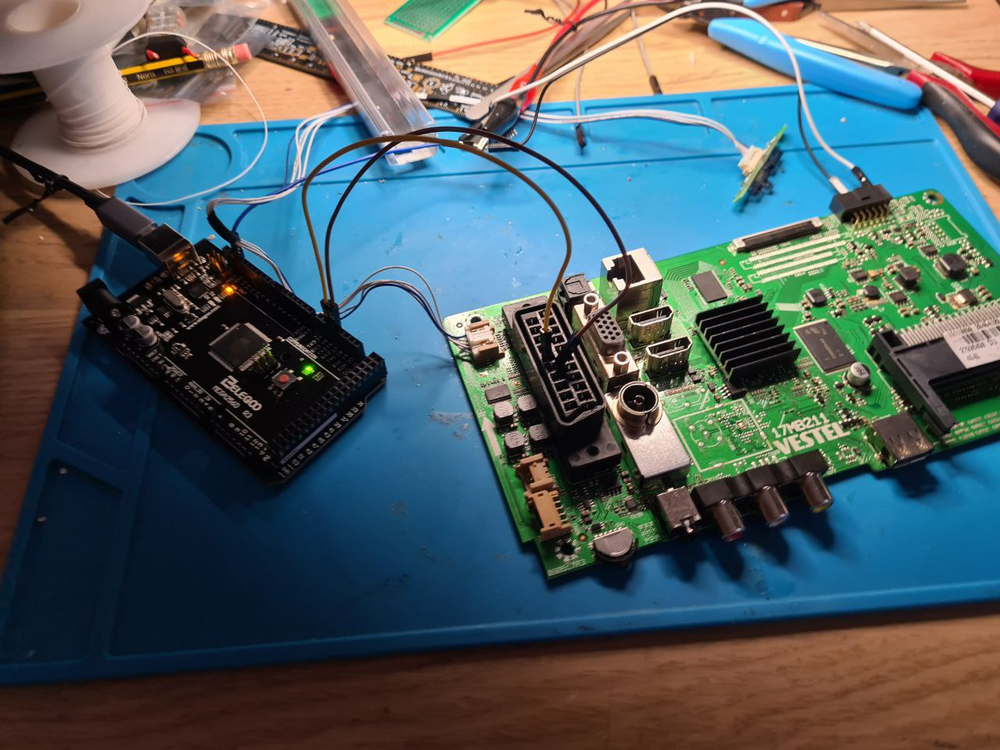
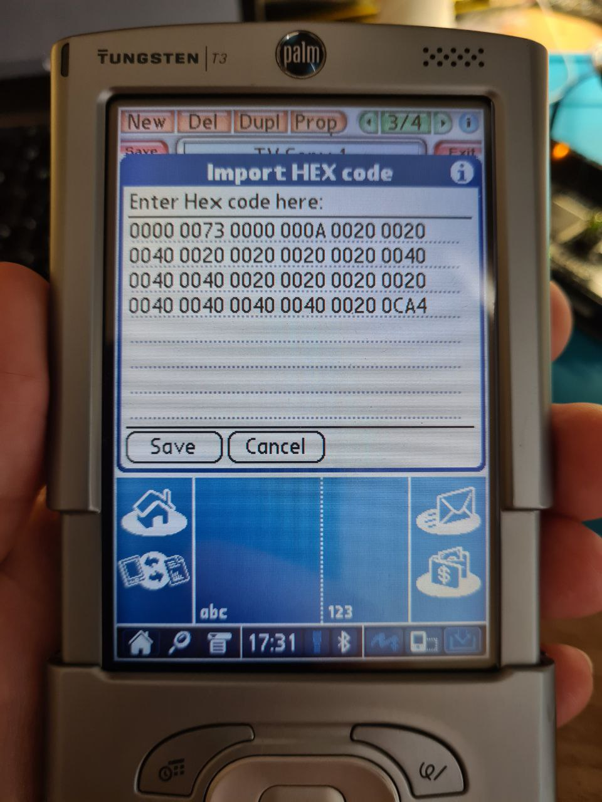
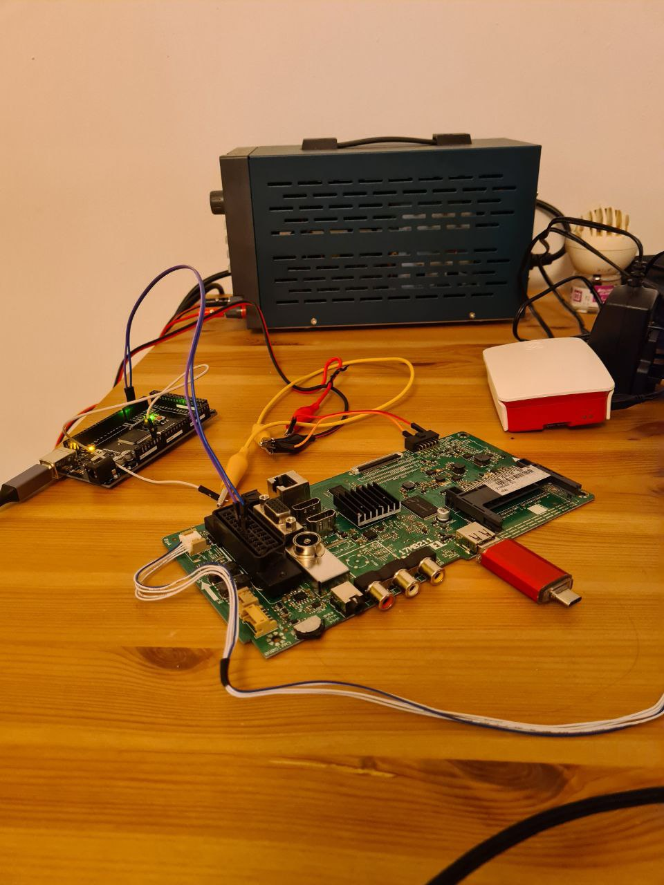
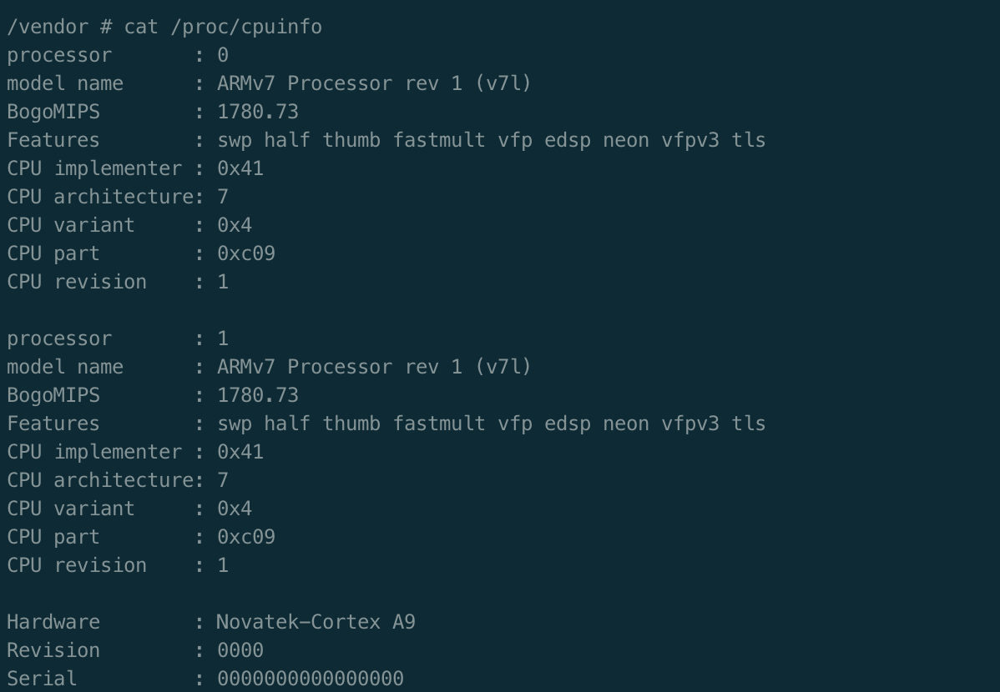
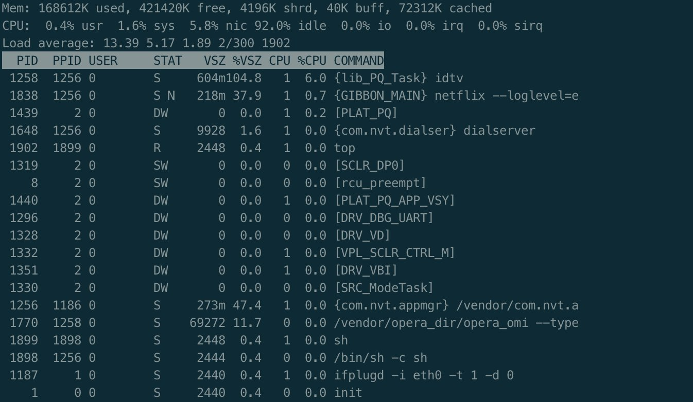

# Single-board computer from a TV

One day I've had a walk and noticed that someone fly-tipped a TV not so far away from my place. The screen was smashed to pieces, the cables were cut or torn, but the TV had one USB and one PCMCIA port, so it must have some sort of a computer inside.


The TV was a no-name, but it was based on a VESTEL 17MB211 motherboard, which is described pretty well online. The power source generates 12V and 24V, the main board has, presumably, dual-core ARM with dual-core Mali GPU, plus 512 MiB or RAM and 512 MiB of flash. Plus two HMDI-ins, SCART/VGA, RF tuner, four USB ports, 10/100 MBit LAN...


The main board was connected to a wireless board. BCM chip is WiFi+Bluetooth, and my guess was that it's either SDIO or non-standard USB connector. The wireless chip itself runs on ARM, by the way.


Turns out, the wireless board is _two_ USB ports on a single connector.


The mainboard can be booted with 12V supply, and there's an UART mapped to SCART connector. The LAN port seemed to be broken and needs re-soldering.


Regular UART allows to send some commands to the mainboard, but to get the full control over the board we need to get to the U-boot menu. The manual explains that it can be done by sending "OK" repeatedly to the IrDA port. "OK" in RC5 is 0x35, and I conveniently have a Palm computer that can send any HEX code over IrDA.


Turns out, my application for IrDA didn't send "OK" repeatedly when I was holding down the button, so I had to tap-tap-tap it. After that, U-boot triggered the update procedure and checked the connected USB stick for a U-boot script.


With the script in place, I dumped the contents of the flash (except for the OTP area for secure boot key), and was really surprised to see that device tree files were not protected by secure boot in the firmware. All it took to get the root was to edit the Linux commandline in the device tree file, and flash it back.

Look at this CPU!


One of the cores is busy with TV-related tasks, but killing the thread activates the Watchdog and reboots the device. Even without it, this is a nice Linux ARM box.

### Extra notes
Stand-by chip inside the SoC is a clone of 8051. At least a part of firmware for it is in a 2MiB SPI, but seems that some part of the 8051 firmware is inside the SoC itself. This flash also stores data for Ethernet and DRM.

Addresses of firmware areas were all wrong in online scripts. For my model, it was:
```
768k(xboot),
768k(ddrcfg),
768k(ddrbud),
768k(xbootdat),
768k(misc),
2M(secos),
1280k(uboot),
768k(fdt0),
768k(fdt1),
7M(ker0),
17M(ker1),
20M(fs0),
200M(ap0),
40M(apdat0),
213M(buffer),
4M(logo)
```
The map of the flash is stored in the cmdline.

Some of these boards run Android, but this one runs a custom "NG Smart" OS, which is Linux + Opera-over-DirectFB.

There are hardware HDMI, SCART and RF ins. Plus LAN. Plus USB. So, it can be turned into a very nice device to capture HDMI/TV/VHS. It also has a 10W amplifier and LVDS, but I doubt it would be easy to connect it to a random screen.
