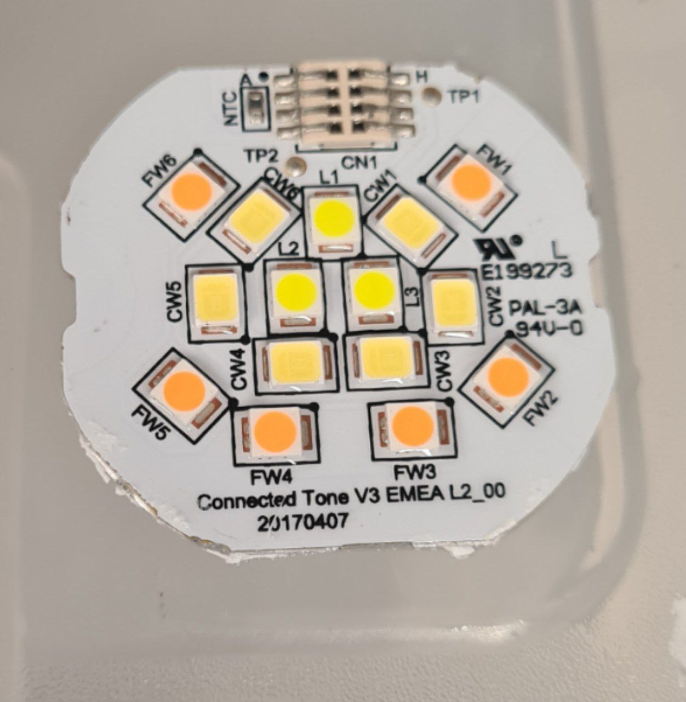
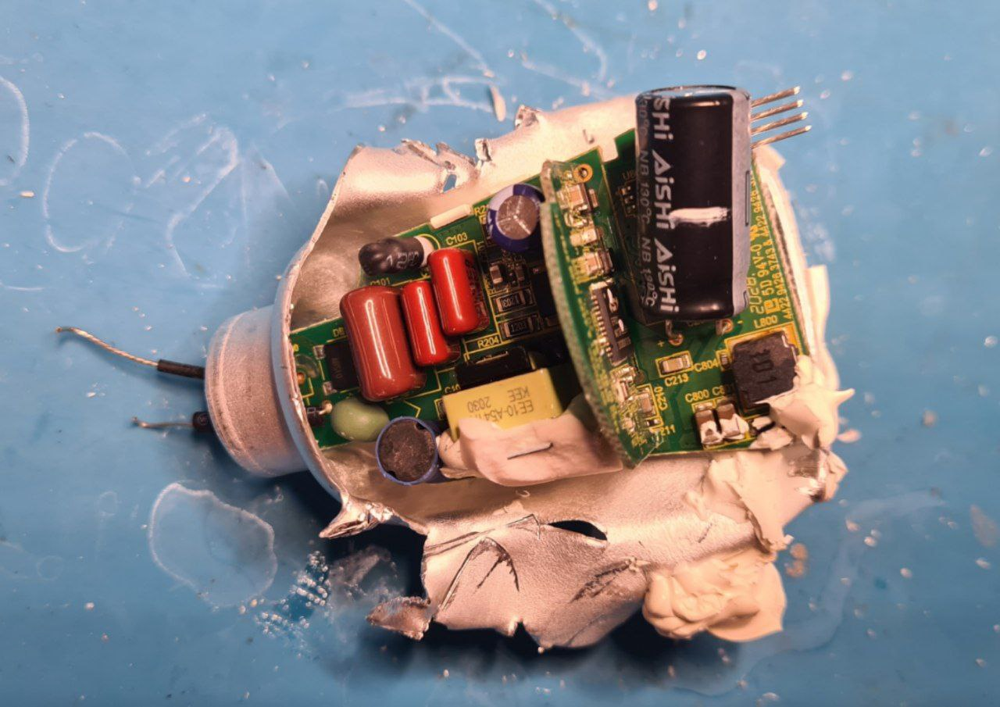
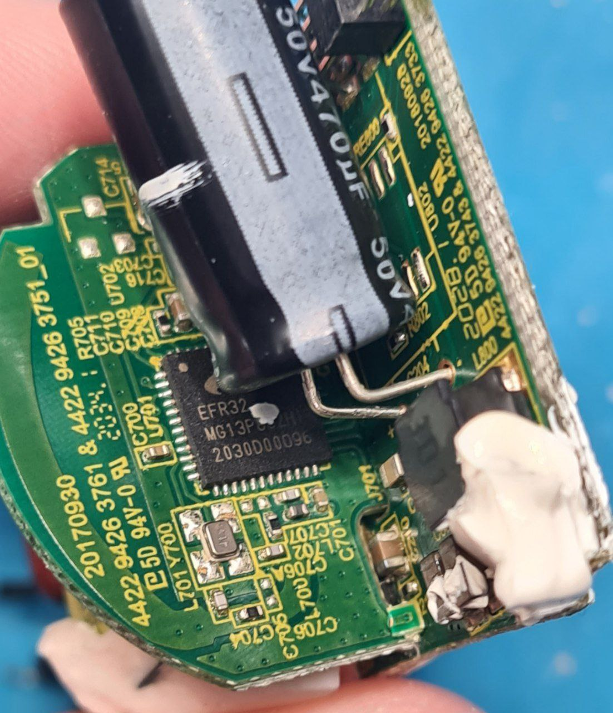
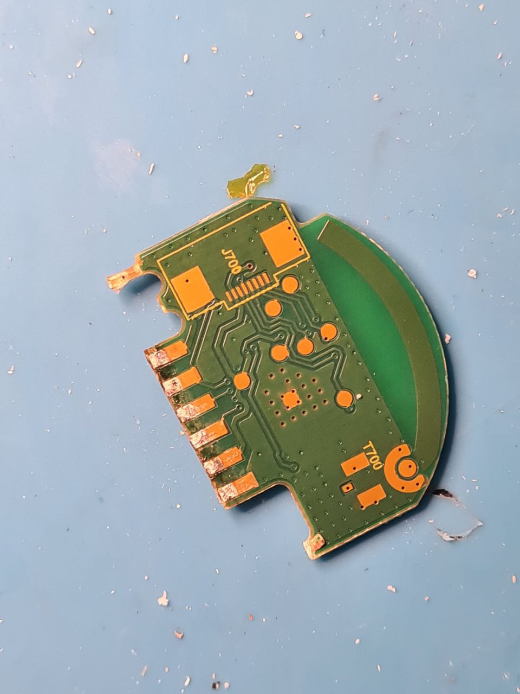

# Lightbulb moment

As it happens, a "smart" lightbulb decided to die on me. It was not made for repairs, but it can be disassembled.

The LED assembly can be safely separated from the lightbulb. It is an aliminium PCB, and it is fully working.

The main assembly is pressed and glued into the lightbulb body.

The microcontroller board hides Silicon Labs EFR32MG13P832 - as far as I can tell, it's a 32-bit ARM Cortex M4 running at 40 MHz. It should have 512KB flash and 64 KB RAM.

The CPU board has convenient debug and control/power ports, as well as crystals and capacitors needed to start it.

I am too tired right now to actually power it up and find the programming port to reflash it.