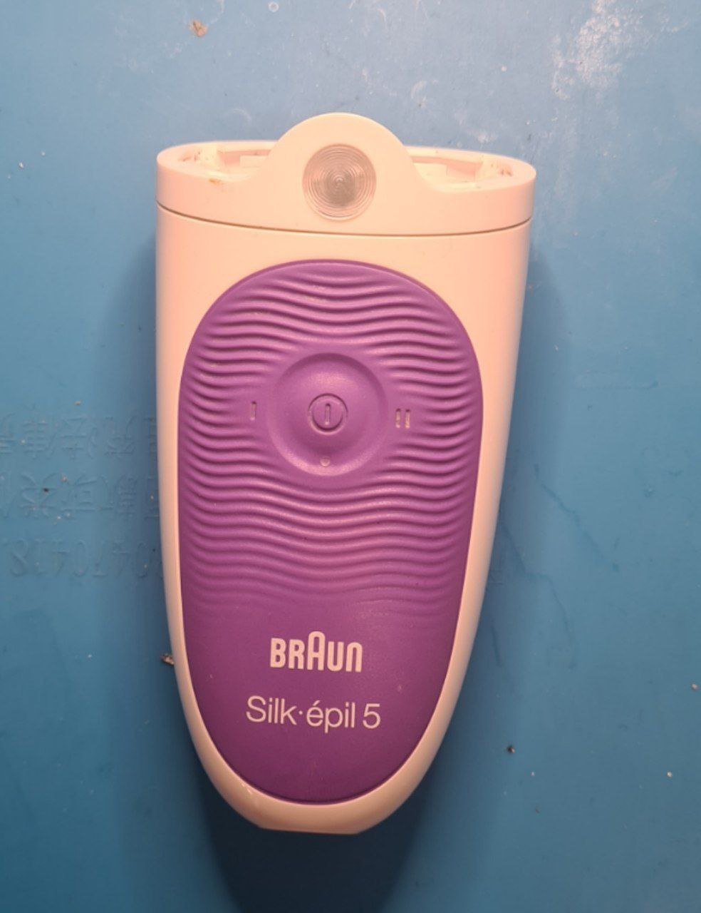
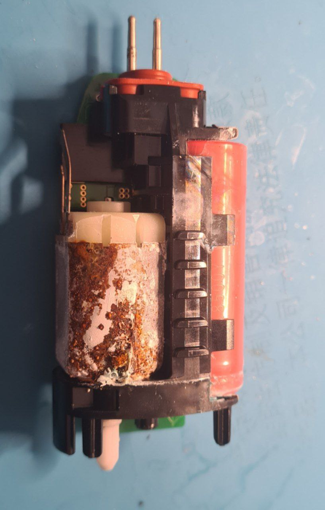
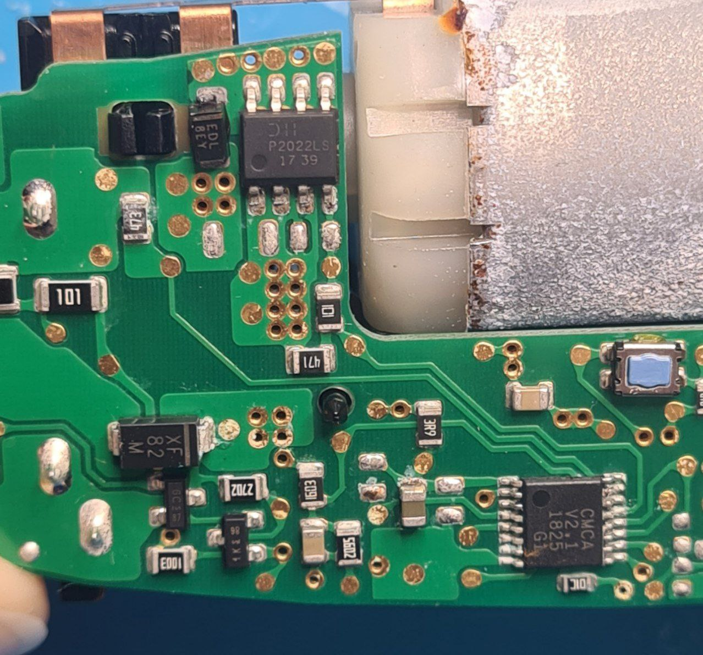

# A battery-powered shaver

Yet another battery died in an electric shaver. This one even leaked and corroded the motor. 

Unlike the previous model, this one isn't water-proof, as far as I can tell. It doesn't have serious seals to protect the board from water. Perhaps, this is what caused its ultimate demise.

The motor and the Li-Ion battery are both covered in rust, but the PCB looks relatively okay. 

Interestingly, the same construction is generally used for many similar devices - shavers, epilators, and so on.

P2022LS you can see there in SOIC-8 is a MOSFET. CMCA v2.1 is clearly a microcontroller, and I am very happy it doesn't look like a beefy ARM chip. 

This controller is not documented online at all, and I couldn't find any matching controllers by pinouts. It'd be interesting to figure out what it is. Some found that connecting pin 11 to pin 15 will "reset the controller" to allow a battery replacement.

On my board, pin 1 is VCC, and pin 8 is GND. Pins 3, 6 and 7 seem to be NC, pin 2 is probably used for something charging-related, as well as pin 16. Pin 15 and 13 are connected to motor and MOSFET, pin 14 is button, and pin 9 is LED.

Pins 4, 5, 10 and 11 seem to be used only for testing of the chip, and pin 12 is connected to something optional for the board.
