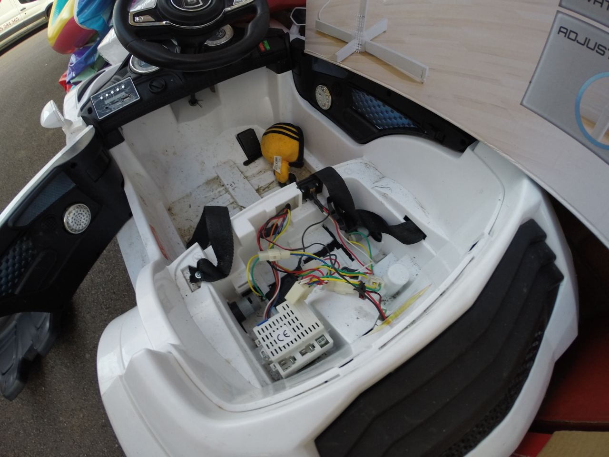
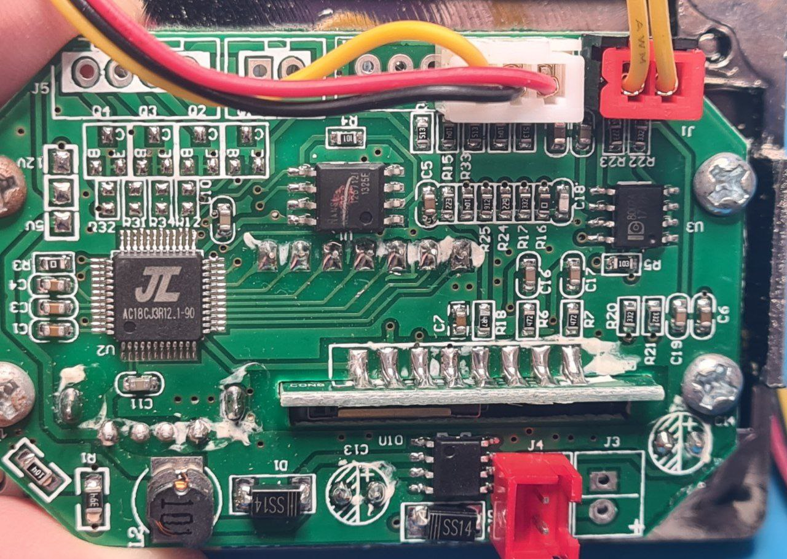
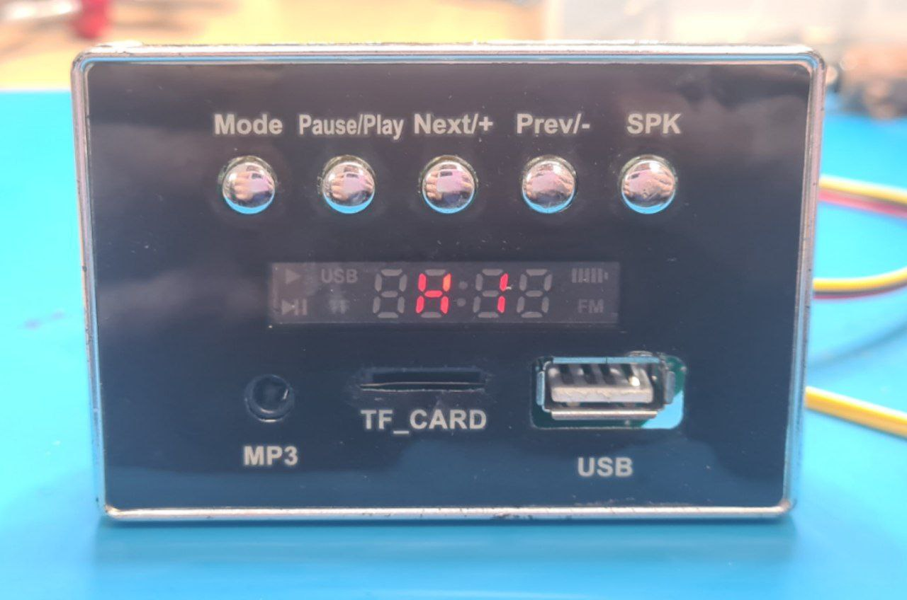
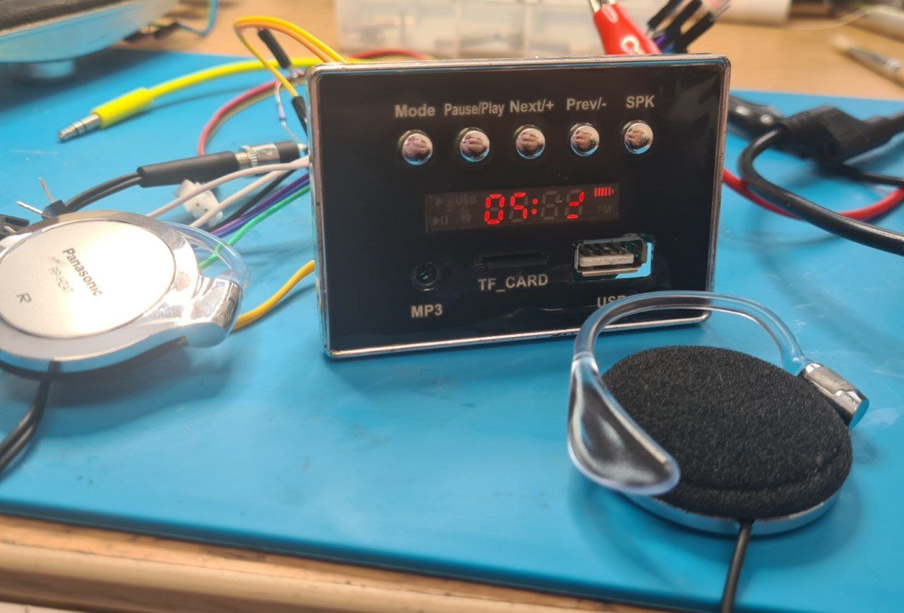

# An mp3 player from a toy car

One day I went home and saw a toy car in the trash.

The toy car had very lame motor, decend lead battery, and - curiously - an MP3 player.

The main chip is a relative of a ZHUHAI JIELI AC69, which is a pi32 architecture. @whitequark mentioned on Twitter that this series of chips (pi32) seems to be an OpenRISC fork.

Moreover, people online mention that similar chips can be triggered to switch into programming mode, reporting as a USB device with UBOOT. [Github with details.](https://github.com/christian-kramer/JieLi-AC690X-Familiarization) But if the device works as expected, why reflash it?

The board has three connectors. One is clearly power (has + and - signs), one has three pins - middle is ground - which turns out to be external keys, and one has two pins - which is audio output.

Powering up the device makes it say "HI" on the 7-segment display. It tries to show time, but the time is wrong. I pressed a bunch of buttons, but couldn't figure out how to switch it to FM radio mode or set up the clock. 

FAT-formatted flash card with mp3 files makes the device say "Lod" and play the music. Volume controls and next/previous track keys work as expected. The volume is quite loud for a headphone output, but not enough to drive real speakers.

The only annoying thing about the player is that the power-on sound is a sound of a car engine starting. I suspect the chip in the middle of the PCB is a flash, and the car engine sound is stored on it. But I'm too lazy to do anything about it right now.
